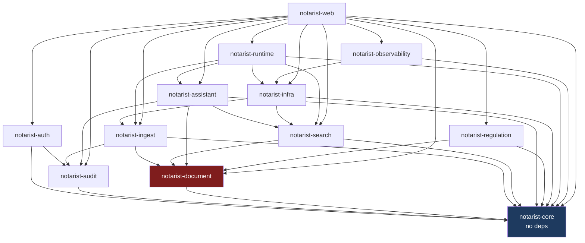
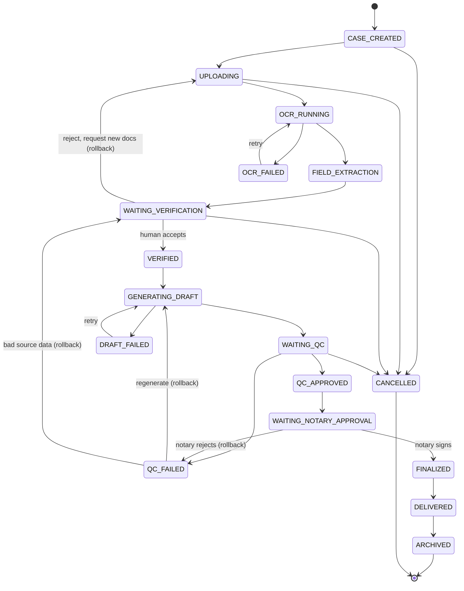

# NOTARIST — Architecture Report: Document-Centric → Case-Centric

| Field | Value |
|---|---|
| Sprint | Backend Architecture (design only) |
| Date | 2026-07-14 |
| Scope | `backend/` only. No frontend, Terraform, GCP, OCR, or Runtime changes. |
| Status | PROPOSAL — nothing implemented, no migrations written |
| Source of truth | Audited against committed source, not from documentation |

---

## 0. Executive Summary

The platform today is a **document ingestion + RAG retrieval system**. The target is an
**operating system for a notary office**, where the root business object is a `CASE` that owns
bundles of documents and drives a human workflow through verification, drafting, QC, approval and
delivery.

The central architectural finding is that **this is not a rename of `Document` to `Case`**. The
existing `DocumentLegal` aggregate and its pipeline are *machine* workflow (OCR → NER → chunk →
embed → index). The Case workflow is *human/business* workflow (verify → draft → QC → approve →
deliver). These are two different altitudes that happen to share the word "status".

> **Design rule adopted throughout this report:** `Case` does not replace `Document`, and the Case
> state machine does not absorb the ingestion pipeline. Case **aggregates** document pipeline state;
> it never re-implements it. Any design that merges them will produce a 26-state monolith that is
> impossible to reason about and will break the existing ingest workers.

Six findings from the audit drive the design. Two of them (F1, F2) change what we can build.

| ID | Finding | Impact |
|---|---|---|
| F1 | `uq_dokumen_checksum_tenant UNIQUE (checksum_sha256, tenant_id)` | **Blocks the Case model.** The same file (e.g. one KTP scan) cannot exist in two cases in one tenant. Must be resolved before Case ships. |
| F2 | Three overlapping status vocabularies already exist | A 4th (Case) must be additive and clearly separated, or the model collapses. |
| F3 | RLS covers only 3 of 13 tables | Every new Case table must be RLS'd from day one (fail-closed). |
| F4 | `RetrievalPipeline` strategy interface has **zero implementations** | Phase 6 routing has a seam to build on, but it is currently dead code. |
| F5 | `audit_trail` is already polymorphic (`subject_type`/`subject_id`/`detail_json`) | **Free win.** Case/Bundle/Approval audit needs *no* schema change. |
| F6 | `DocumentLegal` invariants are unimplemented `TODO`s | Case must not depend on Document enforcing its own rules. |

---

## 1. PHASE 1 — Bounded Context Audit

### 1.1 Actual module dependency graph

Extracted from `backend/*/build.gradle.kts` (`project(":…")` declarations), not from docs.



**`notarist-document` is a hub.** Four modules depend on it (`ingest`, `search`, `assistant`,
`regulation`). This is the coupling that makes "Document is the root aggregate" structural rather
than incidental — it is baked into the build graph.

### 1.2 Where "Document is the root" is assumed

| Assumption site | Evidence | Consequence |
|---|---|---|
| `DocumentLegal` is an aggregate root | `domain/model/DocumentLegal.java` — "Aggregate root for legal documents" | Nothing owns a document; it is top-level |
| Ingestion is keyed by document | `IngestionJob` → `document_id`; `ingestion_queue` indexed on document | A job belongs to a doc, not a case |
| Retrieval is scoped by document | `chunk_index.document_id`, `document_chunk.document_id` | No case-scoped retrieval possible |
| Dedup is tenant-global | `uq_dokumen_checksum_tenant` | See F1 — fatal for cases |
| Audit subject is a document | `subject_type` comment: `USER\|SESSION\|DOCUMENT\|INGESTION_JOB` | Column is generic; only the *vocabulary* is doc-centric |

### 1.3 Service-by-service migration assessment

Difficulty: **L**ow / **M**edium / **H**igh. Breaking risk is risk to *existing API consumers*
(the React Native app that Claude 2 owns, plus `/ops`).

#### DocumentService (`notarist-document`)

- **Current:** Owns `DocumentLegal` as aggregate root; CRUD + list/get by tenant with clearance
  filtering (`DocumentController`, `ListDocumentsQueryHandler`).
- **Future:** `DocumentLegal` **demotes from aggregate root to an entity owned by `Bundle`**. It
  gains a nullable `case_id`/`bundle_id`. It keeps its own machine lifecycle (`DocumentStatus`),
  which the Case reads but never writes.
- **Difficulty:** **M** — the demotion is conceptual; physically it is two nullable FK columns plus
  a repository method. The pain is that four modules depend on this package.
- **Breaking risk:** **LOW**, *if* `case_id` is nullable. `GET /documents` keeps working unchanged
  for documents with no case (all existing rows). **HIGH if made NOT NULL** — that would strand
  every existing document and break the app's Documents tab.

#### IngestionService / PipelineService (`notarist-ingest`)

- **Current:** Per-document pipeline: upload → OCR → NER → chunk → embed → index, driven by
  `PipelineStateMachine` + `StageWorker` subclasses + `ingestion_queue`.
- **Future:** Unchanged mechanically. It gains **event emission upward**: when every document in a
  bundle reaches `COMPLETED`, the Case workflow is notified (`BundleIngestionCompletedEvent`). The
  pipeline itself stays document-scoped — this is correct and must not change.
- **Difficulty:** **L** — additive. Propagate `case_id`/`bundle_id` as pipeline *context* (already
  has a `payload` JSONB to carry it) and emit one new event.
- **Breaking risk:** **LOW**. `POST /ingest`, `/ingest/{jobId}/confirm`, `/ingest/{id}/status` keep
  their exact contracts. **This is load-bearing: the mobile app calls all three.**
- **Caution:** the ingest workers are the most intricate code in the backend (generation guards,
  DLQ, retry). Do not refactor them in this sprint.

#### SearchService (`notarist-search`)

- **Current:** Hybrid retrieval (BM25 + vector → RRF fusion → diversity → rerank → context assembly)
  with a security filter applied **per source, before merge** (good — keep this).
- **Future:** Must become case-aware in two ways: (a) an optional `caseId` retrieval **filter** so a
  user can ask "what's in this case", and (b) intent routing so factual/numeric/status queries never
  reach the LLM (see Phase 6).
- **Difficulty:** **M** — the filter is easy (a predicate through `SecurityFilterService` +
  `chunk_index`); the routing is the real work.
- **Breaking risk:** **LOW** — `POST /search` gains an optional field. Existing calls unaffected.

#### AssistantService (`notarist-assistant`)

- **Current:** RAG orchestration over `SearchPort` with grounding evaluation, hallucination guard,
  citation injection.
- **Future:** Gains an optional case context ("answer within case X") and — critically — must
  **refuse to answer** legal-status and numeric questions from the LLM, deferring to the
  deterministic SQL path (Phase 6).
- **Difficulty:** **M**.
- **Breaking risk:** **MEDIUM** — `POST /assistant/ask` is called by the app. Routing some queries
  to a SQL answer changes the *content* of responses (for the better), but the response envelope
  (`answerText` + `citations` + `confidence`) must stay identical or the app breaks.

#### AuditService (`notarist-audit`)

- **Current:** Generic append-only trail. `AuditEventPayload(subjectType, subjectId, …, detail)`.
- **Future:** Becomes the substrate for the **case timeline** — every workflow transition, approval,
  and QC result is an audit entry.
- **Difficulty:** **L** — see F5. The table is already polymorphic. We add vocabulary
  (`CASE`, `BUNDLE`, `APPROVAL`, `WORKFLOW`), not columns.
- **Breaking risk:** **NONE** (append-only, additive enum values).
- **Note:** the case *timeline* is a read-model **projection over `audit_trail`**, not a new table.
  Building a separate `timeline` table would duplicate data — explicitly forbidden by project rules.

#### AuthService (`notarist-auth`)

- **Current:** JWT issuance with `roles`/`tenantId` claims; RLS context applied per request.
- **Future:** Approval requires **role-gated authority** (only a NOTARIS may finalize an akta). The
  claims needed for this are **already in the JWT** — no auth change required.
- **Difficulty:** **L** (no change; consumed only).
- **Breaking risk:** **NONE**. Per constraints, the auth flow is not touched.

#### Summary table

| Service | Difficulty | Breaking risk | Nature of change |
|---|---|---|---|
| AuditService | L | None | Additive vocabulary; becomes timeline source |
| AuthService | L | None | Consumed as-is |
| IngestionService | L | Low | Carry case context; emit one upward event |
| DocumentService | M | Low (if nullable FK) | Demote from root to bundle-owned entity |
| SearchService | M | Low | Case filter + intent routing |
| AssistantService | M | **Medium** | Must not answer factual/status queries via LLM |
| **CaseService** *(new)* | — | None | New bounded context; owns workflow |

---

## 2. PHASE 3 — Case State Machine

> Full aggregate/UML design is in `02-uml-and-packages.md`. It is separated because the state
> machine is the contract the rest of the design hangs off.

### 2.1 The two-level rule

```
CASE lifecycle   (business / human)   ← this state machine
   └── owns BUNDLE(s)
          └── owns DOCUMENT(s)
                 └── DocumentStatus / PipelineStatus  (machine / existing — UNCHANGED)
```

`CASE.state = OCR_RUNNING` is a **derived summary** of "≥1 document in this case's bundle is not yet
`COMPLETED`". The Case does not drive OCR; it *observes* it. This keeps the existing ingest workers
untouched (a hard constraint) and prevents the state explosion described in F2.

### 2.2 States



### 2.3 Transition table (authoritative)

| From | Allowed to | Trigger | Actor |
|---|---|---|---|
| `CASE_CREATED` | `UPLOADING`, `CANCELLED` | first document attached | STAFF |
| `UPLOADING` | `OCR_RUNNING`, `CANCELLED` | bundle marked complete | STAFF |
| `OCR_RUNNING` | `FIELD_EXTRACTION`, `OCR_FAILED` | all docs `COMPLETED` / any `DLQ` | SYSTEM |
| `OCR_FAILED` | `OCR_RUNNING` | operator retry | STAFF/ADMIN |
| `FIELD_EXTRACTION` | `WAITING_VERIFICATION` | NER fields extracted | SYSTEM |
| `WAITING_VERIFICATION` | `VERIFIED`, `UPLOADING`, `CANCELLED` | human verdict | STAFF/NOTARIS |
| `VERIFIED` | `GENERATING_DRAFT` | draft requested | STAFF |
| `GENERATING_DRAFT` | `WAITING_QC`, `DRAFT_FAILED` | generation result | SYSTEM |
| `DRAFT_FAILED` | `GENERATING_DRAFT` | retry | STAFF |
| `WAITING_QC` | `QC_APPROVED`, `QC_FAILED`, `CANCELLED` | checklist evaluated | SYSTEM+HUMAN |
| `QC_FAILED` | `GENERATING_DRAFT`, `WAITING_VERIFICATION` | rollback path chosen | STAFF |
| `QC_APPROVED` | `WAITING_NOTARY_APPROVAL` | submit for signature | STAFF |
| `WAITING_NOTARY_APPROVAL` | `FINALIZED`, `QC_FAILED` | notary decision | **NOTARIS only** |
| `FINALIZED` | `DELIVERED` | delivery dispatched | STAFF |
| `DELIVERED` | `ARCHIVED` | retention job | SYSTEM |
| `ARCHIVED` | — | — | — |
| `CANCELLED` | — | — | — |

### 2.4 State classification

| Class | States | Rule |
|---|---|---|
| **Terminal** | `ARCHIVED`, `CANCELLED` | No outbound transitions. Immutable. Mirrors the existing `isTerminal()` convention in `PipelineStatus`. |
| **Retry** | `OCR_FAILED`, `DRAFT_FAILED` | Re-enter the *same* stage. Bounded attempt count; exhausting it does **not** auto-cancel — it parks for human decision. |
| **Rollback** | `QC_FAILED` → `GENERATING_DRAFT` \| `WAITING_VERIFICATION`; `WAITING_VERIFICATION` → `UPLOADING`; `WAITING_NOTARY_APPROVAL` → `QC_FAILED` | Moves *backwards* to an earlier human stage. Always requires a recorded reason + actor (audit). |
| **Waiting (human gate)** | `WAITING_VERIFICATION`, `WAITING_QC`, `WAITING_NOTARY_APPROVAL` | No system transition. These are the states a Reminder can fire on. |
| **System (automatic)** | `OCR_RUNNING`, `FIELD_EXTRACTION`, `GENERATING_DRAFT` | Advance without human input. |

**Design decisions worth flagging:**

- `FINALIZED` is **not** terminal — the brief lists `DELIVERED` and `ARCHIVED` after it. A finalized
  akta still must be delivered and archived.
- `QC_FAILED` is **not** terminal and not a dead end. It is the hinge of the whole workflow: it can
  roll back to *drafting* (draft was wrong) or to *verification* (source data was wrong). Getting
  this distinction wrong is the most likely design error in this workflow.
- `CANCELLED` is added (not in the brief). Without it, an abandoned case is stuck in a waiting state
  forever and reminders fire on it indefinitely.
- Rollback edges must never silently discard the prior draft. Draft versions are retained
  (`workflow`/`approval` history), because a notary office needs to show what changed and why.

---

## 3. PHASE 6 — Search & Answer Routing

### 3.1 The current defect

`IntentClassifier` classifies every query into one of five `SearchIntent` values. **That
classification is then never used to choose a strategy.** `RetrievalPipeline` — the interface whose
Javadoc claims "implementations … selected based on `SearchQuery.intent`" — has **zero
implementations** in the codebase (verified by grep). Every query, including
`"berapa nomor akta 123/VII/2024"`, takes the same path:

```
classify → normalize → BM25 + vector → RRF fusion → diversity → rerank → LLM
```

This directly violates the constraint **"never allow numerical or legal status queries to go through
LLM"** — today, they all do. A question like *"is akta 42 already signed?"* is currently answered by
an LLM reading retrieved text chunks, which can hallucinate a legal status. In a notary office that
is not a quality issue; it is a liability.

### 3.2 Proposed routing

The router runs **before** retrieval and picks exactly one strategy. Deterministic first, LLM last.

| Query class | Example | Route | LLM allowed? |
|---|---|---|---|
| **Numeric / identifier lookup** | "akta nomor 123/VII/2024", "NIK 3204…" | **SQL** — exact match on `dokumen_legal.nomor_akta`, `case.case_number` | **NEVER** |
| **Legal / workflow status** | "sudah ditandatangani?", "status case X", "sudah selesai QC?" | **SQL** — read `case.state`, `approval` | **NEVER** |
| **Counting / aggregation** | "berapa akta bulan ini" | **SQL** — `COUNT(*)` with tenant + RLS | **NEVER** |
| **Document lookup by attribute** | "akta fidusia Budi" | **Hybrid** (BM25 + vector) → return *documents*, not prose | No (list result) |
| **Regulation / citation lookup** | "pasal 15 UU Jabatan Notaris" | **Hybrid**, citation-first | Optional, must cite |
| **Semantic / explanatory** | "apa syarat APHT?" | **Vector → rerank → LLM (RAG)** | **Yes**, grounded + cited |

### 3.3 The hard rule, enforced structurally

Routing by regex alone is not sufficient — a classifier miss would silently leak a status question
into the LLM. Two layers:

1. **Router (positive selection):** `AnswerRouter` returns a `RouteDecision`. `SQL` routes never
   construct an `LlmRequest` at all — the LLM port is not on that code path.
2. **Guard (negative assertion):** a `FactualQueryGuard` on the LLM boundary refuses to serve any
   query classified `NUMERIC_LOOKUP`, `STATUS_LOOKUP` or `AGGREGATION`, and **fails closed** (returns
   the deterministic answer or an explicit "cannot answer") rather than falling back to the LLM.

`GroundingEvaluator` / `HallucinationGuard` already exist and stay — but they are a *quality* net for
semantic answers, not a substitute for never routing a status query to an LLM in the first place.

### 3.4 Ambiguity

When the router is uncertain (e.g. *"ceritakan tentang akta 123"* — an identifier *and* an
explanatory verb), it must **resolve the identifier via SQL first**, then use the LLM only to
explain the retrieved, verified record. The numeric fact always comes from the database; the prose
comes from the model. Never the reverse.

---

## 4. Cross-cutting risks discovered

### R1 — `uq_dokumen_checksum_tenant` blocks the Case model *(blocker, F1)*

`dokumen_legal` has `UNIQUE (checksum_sha256, tenant_id)`. In a notary office the *same* file
legitimately appears in many cases (a client's KTP, a standard SOP annex). Under the Case model this
constraint makes the second case's upload fail with a duplicate error.

The `DuplicateDetector` in `notarist-ingest` relies on this behaviour, so this cannot be changed
casually. Options, in preference order:

1. **Content-addressed storage + per-bundle link** (recommended): keep one physical blob per
   checksum per tenant, and let `bundle_document` reference it many times. Dedup is preserved
   (storage and OCR are not repeated — an efficiency *win*), while a file can belong to N cases.
   Requires the unique constraint to move off the "document instance" concept.
2. Relax to `UNIQUE (checksum_sha256, tenant_id, case_id)` — simpler, but re-OCRs the same file per
   case and duplicates blobs. Violates the project's "never duplicate data" rule.

**Decision required from you** before any Case implementation. Option 1 is more work but is the only
one consistent with the stated rules.

### R2 — RLS covers 3 tables of 13 *(F3)*

`ENABLE ROW LEVEL SECURITY` is set on `notarist_user`, `dokumen_legal`, `ingestion_job` only. Not on
`document_chunk`, `chunk_index`, `audit_trail`, `ingestion_queue`, `dead_letter_queue`,
`search_query_log`. Tenant isolation for those relies on application-level `WHERE tenant_id = …`.

This is pre-existing and outside this sprint's remit to fix, but it is **directly load-bearing for
Case**: every new table (`case`, `bundle`, `workflow`, `approval`, `reminder`, `qc_checklist`) must
ship with RLS enabled and a fail-closed policy in the *same* migration that creates it. Retrofitting
RLS later is how tenant leaks happen.

### R3 — Domain invariants are TODOs *(F6)*

`DocumentLegal.transitionStatus()` and `markIndexed()` carry `// TODO (STEP 8B): enforce…` and
currently perform **unguarded** field assignment. The rules live only in the static
`DocumentStatusMachine`, which a caller can bypass entirely by calling the setter directly.

The Case aggregate must therefore **enforce its own invariants internally** (the state machine lives
*inside* `Case.transitionTo()`, not beside it in a static helper). Do not copy the existing pattern.

### R4 — Status vocabulary sprawl *(F2)*

Already present: `DocumentStatus` (14 values), `PipelineStatus` (12), `PipelineStage` (12, marked
"replaced… skeleton" but still compiled and referenced). Adding `CaseState` makes four. The
mitigation is the two-level rule (§2.1) plus a naming convention: `CaseState` values never reuse a
`DocumentStatus` name except where they are genuinely the aggregate summary (`OCR_RUNNING`).

`PipelineStage` should be deleted as dead code — but **not in this sprint** (out of scope; logged as
debt).

---

## 5. What this sprint does NOT change

Per your constraints, and verified as untouched:

- No frontend file modified (Claude 2 owns `frontend/`).
- No Terraform, Cloud Run, GCS, or deployment config.
- No OCR implementation, Runtime abstraction, LLM, embedding, or reranker internals.
- No auth/JWT flow.
- **No migrations written, no code implemented.** Design only.
- Existing API contracts preserved — see `04-api-proposal.md`.
