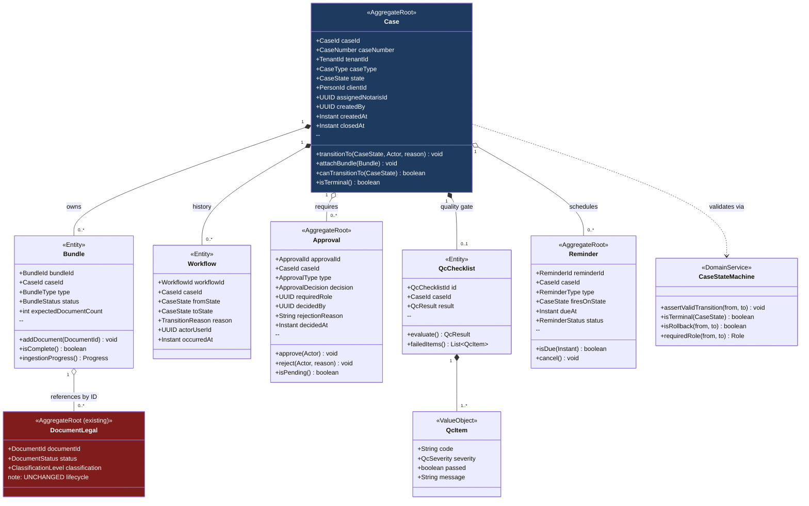
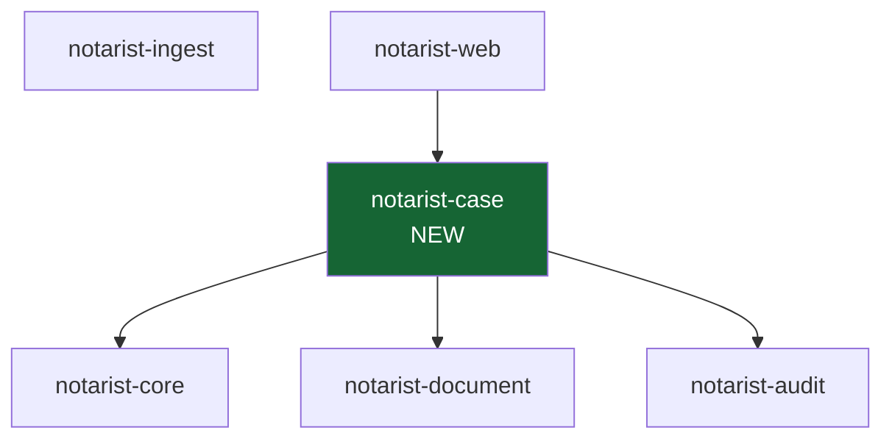
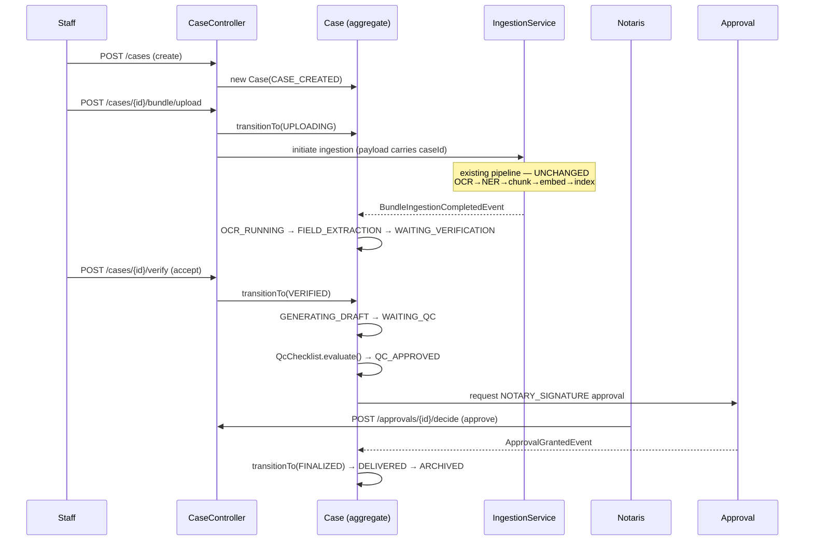

# NOTARIST — Phase 2: Aggregate Design, UML & Package Structure

| Field | Value |
|---|---|
| Status | PROPOSAL — design only, not implemented |
| Depends on | `01-architecture-report.md` (§2.1 two-level rule) |
| Date | 2026-07-14 |

---

## 1. Aggregate boundaries

The single most important decision: **which objects are aggregate roots** (transaction + consistency
boundaries), and which are entities inside them.

| Object | Role | Rationale |
|---|---|---|
| **Case** | **Aggregate root** | The new business root. Owns workflow state. Transaction boundary for every state change. |
| **Bundle** | Entity within Case | A bundle has no meaning outside its case. Never loaded independently. |
| **Document** | **Aggregate root (retained)** | *Deliberately stays a root.* See §1.1 — this is the key call. |
| **Workflow** | Entity within Case | The transition history of one case. |
| **Approval** | **Aggregate root** | Has independent lifecycle + legal significance; queried on its own ("all approvals awaiting me"). |
| **QcChecklist** | Entity within Case | Meaningless without its case; evaluated as a unit. |
| **Reminder** | **Aggregate root** | Scheduled independently by a background job; must be queried without loading its case. |

### 1.1 Why Document stays an aggregate root

The instinctive model is `Case → Bundle → Document` as one big aggregate. **Rejected**, for three
reasons grounded in the existing code:

1. **The ingest pipeline mutates documents concurrently.** Five worker types (`OcrWorker`,
   `NerWorker`, `ChunkWorker`, `EmbeddingWorker`, `IndexingWorker`) update document/job state
   independently. If `Document` were inside the `Case` aggregate, every OCR completion would have to
   take a lock on the whole Case — serialising the pipeline and creating contention on a case with
   20 documents.
2. **Documents outlive and pre-date cases.** Every existing row has no case (`case_id` will be
   nullable — see the backward-compatibility requirement). A model where documents *must* have a
   parent cannot represent the data we already have.
3. **Retrieval is document/chunk-scoped.** `chunk_index.document_id` is the retrieval key.

So: **Case references Documents by ID through Bundle; it does not contain them.** The link table
carries the relationship. This is the standard "aggregate references aggregate by identity" rule, and
it is what keeps the existing ingest workers untouched.

---

## 2. Class diagram



**Legend:** `*--` composition (owned, same aggregate) · `o--` association (referenced by identity,
separate aggregate/transaction).

---

## 3. Aggregate responsibilities

### Case
Owns the workflow state and is the **only** object permitted to change it. `transitionTo()` calls
`CaseStateMachine` internally and rejects invalid transitions — the invariant lives *inside* the
aggregate, deliberately **not** repeating the `DocumentLegal` mistake where the state machine is a
static helper the caller can bypass (report F6/R3).

Every transition appends a `Workflow` record and emits a domain event. There is no setter for
`state`.

### Bundle
Groups the documents required for one purpose within a case (e.g. `IDENTITY_DOCS`,
`LAND_CERTIFICATES`, `SUPPORTING`). Knows how many documents it *expects*, so it can report
"3 of 5 uploaded". Computes ingestion progress by reading referenced documents' `DocumentStatus` —
**read-only**; it never writes document state.

### Workflow
An append-only transition log per case. This is the **domain** record of *why* a case moved. It is
distinct from `audit_trail` (which is the *security/compliance* record). They overlap deliberately:
audit is immutable, tenant-wide, and includes non-case events; workflow is case-scoped and drives UI.

> **Non-duplication note:** the *case timeline* the UI shows is a **projection over `audit_trail`**,
> not a third store. `Workflow` holds only what the domain needs to enforce rules (previous state,
> rollback origin). See `03-database-proposal.md` §5.

### Approval
A pending decision assigned to a **role**, not a person ("any NOTARIS"), resolved by a person. Kept
as its own aggregate because the primary query is cross-case: *"what is waiting for my signature?"* —
loading every Case to answer that would be wasteful.

`WAITING_NOTARY_APPROVAL` requires an `Approval` of type `NOTARY_SIGNATURE` whose `requiredRole` is
`NOTARIS`. The role check uses JWT claims that **already exist** — no auth change.

### QcChecklist
A set of `QcItem` results evaluated against the generated draft. Distinguishes `BLOCKING` from
`WARNING` severity: any failed `BLOCKING` item forces `QC_FAILED`; warnings annotate but permit
`QC_APPROVED`. This is what makes `WAITING_QC → QC_APPROVED|QC_FAILED` deterministic rather than a
matter of opinion.

### Reminder
Fires on **human-gate states only** (`WAITING_VERIFICATION`, `WAITING_QC`,
`WAITING_NOTARY_APPROVAL`) — a case sitting in `OCR_RUNNING` needs no nagging, it needs a worker.
Auto-cancelled when the case leaves the state it fires on, which prevents the classic bug of
reminding a notary to sign something already signed.

---

## 4. Value objects (new)

Placed in `notarist-core` alongside the existing `DocumentId`, `PersonId`, `NomorAkta`, etc., so
every module can reference a case without depending on `notarist-case`.

| VO | Notes |
|---|---|
| `CaseId` | UUID wrapper, mirrors existing `DocumentId` pattern |
| `CaseNumber` | Human-facing, tenant-unique, format `{seq}/{roman-month}/{year}` — mirrors existing `NomorAkta` convention |
| `BundleId`, `WorkflowId`, `ApprovalId`, `ReminderId`, `QcChecklistId` | UUID wrappers |
| `CaseState` | The 16-value enum from report §2.3 |
| `CaseType` | `JUAL_BELI`, `FIDUSIA`, `APHT`, `SKMHT`, `ROYA`, `PENDIRIAN_PT`, … reuses existing `JenisAkta` semantics |
| `ApprovalDecision` | `PENDING`, `APPROVED`, `REJECTED` |
| `QcSeverity` | `BLOCKING`, `WARNING` |

---

## 5. Package structure

A **new bounded context**, `notarist-case`, following the hexagonal layout every existing module
already uses (`api` / `application` / `domain` / `infrastructure` / `config`). No existing module is
restructured.

```
backend/notarist-case/
└── src/main/java/com/notarist/kase/          # `case` is a Java keyword → package `kase`
    ├── api/
    │   ├── rest/
    │   │   ├── CaseController.java
    │   │   ├── BundleController.java
    │   │   ├── ApprovalController.java
    │   │   └── WorkflowController.java
    │   ├── request/
    │   │   ├── CreateCaseRequest.java
    │   │   ├── AttachDocumentRequest.java
    │   │   ├── VerificationDecisionRequest.java
    │   │   └── ApprovalDecisionRequest.java
    │   └── response/
    │       ├── CaseResponse.java
    │       ├── CaseDetailResponse.java
    │       ├── BundleResponse.java
    │       ├── TimelineResponse.java
    │       └── ApprovalResponse.java
    ├── application/
    │   ├── command/            # CreateCaseCommand, TransitionCaseCommand, DecideApprovalCommand
    │   ├── query/              # GetCaseQuery, ListCasesQuery, GetTimelineQuery
    │   ├── handler/
    │   │   ├── command/
    │   │   └── query/
    │   ├── port/
    │   │   ├── in/             # CreateCaseUseCase, TransitionCaseUseCase, DecideApprovalUseCase
    │   │   └── out/            # CaseRepository, BundleRepository, ApprovalRepository,
    │   │                       # ReminderRepository, WorkflowRepository, CaseTimelinePort
    │   ├── service/            # CaseProgressCalculator, QcEvaluationService
    │   └── listener/           # IngestionCompletedListener → advances OCR_RUNNING → FIELD_EXTRACTION
    ├── domain/
    │   ├── model/              # Case, Bundle, Workflow, Approval, QcChecklist, QcItem, Reminder
    │   │                       # CaseState, CaseType, BundleStatus, ApprovalDecision, QcSeverity
    │   ├── service/            # CaseStateMachine, QcRuleSet
    │   ├── event/              # CaseCreatedEvent, CaseTransitionedEvent, ApprovalRequestedEvent,
    │   │                       # ApprovalGrantedEvent, QcFailedEvent, CaseDeliveredEvent
    │   └── exception/          # InvalidCaseTransitionException, ApprovalAuthorityException
    ├── infrastructure/
    │   ├── persistence/postgres/   # *JpaEntity, *JpaRepository, *RepositoryImpl
    │   ├── projection/             # AuditTrailTimelineProjection (timeline read-model)
    │   ├── event/                  # CaseAuditEventPublisher
    │   ├── scheduler/              # ReminderScheduler
    │   └── security/               # RlsContextApplier (mirrors existing per-module pattern)
    └── config/
        └── CaseModuleConfig.java
```

### 5.1 Build graph placement



`notarist-case` depends on `core`, `document` (to read `DocumentStatus` for progress) and `audit`.

**Critically, it does NOT depend on `notarist-ingest`, and `ingest` does not depend on `case`.** A
direct dependency either way creates a cycle risk and couples the human workflow to the machine
pipeline. Instead they communicate via **domain events** on the existing Spring event bus (the
pattern `IngestionEventPublisher` / `AuditEventListener` already establish):

```
ingest emits  ──▶  BundleIngestionCompletedEvent  ──▶  case listens
                   (carries caseId from job payload)     IngestionCompletedListener
```

`ingest` remains ignorant of cases; it just echoes back the `caseId` it was handed in the job
`payload` JSONB (which already exists on `ingestion_queue`).

---

## 6. Sequence: the happy path


