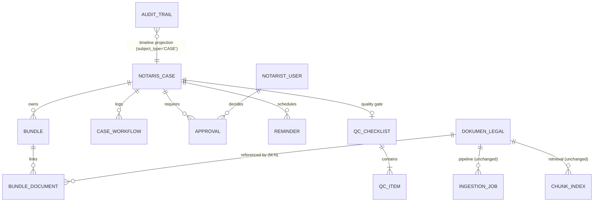

# NOTARIST — Phase 4: Database Proposal (DESIGN ONLY)

| Field | Value |
|---|---|
| Status | **PROPOSAL. No migration written. No DDL executed.** |
| Target | Supabase PostgreSQL (Oracle removed) |
| Authoritative schema location | `backend/notarist-infra/src/main/resources/db/postgres/flyway/` |
| Next free version | **V10** (V1–V9 exist) |
| Date | 2026-07-14 |

> ⚠️ **Schema-location correction.** The top-level `database/postgres/flyway/` directory is **stale**
> — it lacks `dokumen_legal`, `notarist_user` and all RLS. The migrations Flyway actually runs live in
> `backend/notarist-infra/src/main/resources/db/postgres/flyway/` (V1–V9). Any migration written
> against the `database/` copy would be silently ignored. Logged as debt; not fixed in this sprint.

---

## 1. Existing schema (audited, 13 tables)

| Table | Owner module | Reused for Case? |
|---|---|---|
| `notarist_user` | auth | ✅ FK target for actors |
| `user_role_map` | auth | ✅ role gating for approvals |
| `session_token`, `token_deny_list` | auth | — |
| `dokumen_legal` | document | ✅ **extended** (2 nullable FKs) |
| `ingestion_job` | ingest | ✅ **extended** (case context) |
| `ingestion_queue`, `dead_letter_queue` | ingest | — (payload JSONB already carries context) |
| `document_chunk`, `chunk_index` | search | ✅ **extended** (case filter) |
| `pipeline_run` | observability | — |
| `search_query_log` | search | — |
| `audit_trail` | audit | ✅ **timeline source — no schema change** |

---

## 2. Reuse decisions (what we do NOT build)

The project rule is *never duplicate data*. Three tables in the brief are therefore **not** created:

### 2.1 `timeline` — **NOT CREATED** ✅ reuse `audit_trail`

`audit_trail` is already polymorphic:

```sql
event_category  VARCHAR(32)   -- DOCUMENT|INGEST|SEARCH|ASSISTANT|AUTH|SECURITY|UNKNOWN
subject_type    VARCHAR(64)   -- USER|SESSION|DOCUMENT|INGESTION_JOB
subject_id      VARCHAR(200)
actor_user_id   UUID
detail_json     JSONB
```

A case timeline is exactly `SELECT … FROM audit_trail WHERE subject_type='CASE' AND subject_id=:caseId
ORDER BY created_at`. We add **vocabulary**, not columns: `event_category` gains `CASE`, and
`subject_type` gains `CASE|BUNDLE|APPROVAL`. Both columns are free-text `VARCHAR` — **zero DDL
required**; only the trailing comment and the Java enum change.

Creating a `timeline` table would duplicate every audit row. Rejected.

### 2.2 `audit` — **NOT CREATED** ✅ `audit_trail` already exists

Append-only, indexed on `(tenant_id, created_at)`, `(actor)`, `(subject)`. Nothing to add.

### 2.3 `workflow` — **CREATED, but minimal**

It would be tempting to skip this too and derive history from `audit_trail`. **Rejected**: audit is a
*compliance* store (append-only, may be archived/rotated, deliberately generic). The domain needs to
enforce rules against previous state — e.g. `QC_FAILED` must know whether it came from drafting or
from verification to offer the right rollback. Depending on a compliance log for a *business
invariant* is fragile. So `workflow` stores only what the domain enforces against, and remains far
narrower than the timeline.

---

## 3. New tables

All identifiers follow existing convention: `VARCHAR(36)` for entity ids (matching `dokumen_legal`),
`UUID` for user ids (matching `audit_trail.actor_user_id`), `TIMESTAMPTZ` timestamps.

### 3.1 `notaris_case`

> Named `notaris_case`, not `case` — `CASE` is a reserved SQL keyword and would require quoting
> everywhere.

```sql
CREATE TABLE IF NOT EXISTS notaris_case (
    case_id             VARCHAR(36)  NOT NULL,
    case_number         VARCHAR(100) NOT NULL,   -- {seq}/{roman}/{year}, human-facing
    case_type           VARCHAR(50)  NOT NULL,   -- JUAL_BELI|FIDUSIA|APHT|SKMHT|ROYA|…
    state               VARCHAR(50)  NOT NULL,   -- CaseState enum (16 values)
    title               VARCHAR(500) NOT NULL,
    client_person_id    VARCHAR(36),             -- future PERSON_MASTER FK
    assigned_notaris_id UUID,                    -- who must sign
    tenant_id           VARCHAR(36)  NOT NULL,
    created_by          UUID         NOT NULL,
    created_at          TIMESTAMPTZ  NOT NULL DEFAULT NOW(),
    updated_at          TIMESTAMPTZ  NOT NULL DEFAULT NOW(),
    closed_at           TIMESTAMPTZ,             -- set on ARCHIVED|CANCELLED

    CONSTRAINT pk_notaris_case PRIMARY KEY (case_id),
    CONSTRAINT uq_case_number_tenant UNIQUE (case_number, tenant_id),
    CONSTRAINT fk_case_created_by FOREIGN KEY (created_by) REFERENCES notarist_user (user_id),
    CONSTRAINT fk_case_notaris    FOREIGN KEY (assigned_notaris_id) REFERENCES notarist_user (user_id)
);

CREATE INDEX idx_case_tenant_state   ON notaris_case (tenant_id, state);
CREATE INDEX idx_case_notaris_state  ON notaris_case (assigned_notaris_id, state);  -- "my queue"
CREATE INDEX idx_case_number         ON notaris_case (case_number);                 -- SQL lookup route
```

### 3.2 `bundle`

```sql
CREATE TABLE IF NOT EXISTS bundle (
    bundle_id       VARCHAR(36) NOT NULL,
    case_id         VARCHAR(36) NOT NULL,
    bundle_type     VARCHAR(50) NOT NULL,   -- IDENTITY|LAND_CERTIFICATE|SUPPORTING|DRAFT_OUTPUT
    status          VARCHAR(50) NOT NULL,   -- OPEN|COMPLETE|LOCKED
    expected_document_count INT,            -- drives "3 of 5 uploaded"
    tenant_id       VARCHAR(36) NOT NULL,   -- denormalised for RLS (see §4)
    created_at      TIMESTAMPTZ NOT NULL DEFAULT NOW(),

    CONSTRAINT pk_bundle PRIMARY KEY (bundle_id),
    CONSTRAINT fk_bundle_case FOREIGN KEY (case_id)
        REFERENCES notaris_case (case_id) ON DELETE CASCADE
);

CREATE INDEX idx_bundle_case ON bundle (case_id);
```

### 3.3 `bundle_document` — the link table (resolves R1)

This is the table that lets one physical document belong to many bundles/cases **without copying
the blob or re-running OCR** — the content-addressed option from report §R1.

```sql
CREATE TABLE IF NOT EXISTS bundle_document (
    bundle_id     VARCHAR(36) NOT NULL,
    document_id   VARCHAR(36) NOT NULL,
    tenant_id     VARCHAR(36) NOT NULL,
    role_in_bundle VARCHAR(50),            -- KTP|NPWP|SERTIFIKAT|DRAFT|…
    added_by      UUID        NOT NULL,
    added_at      TIMESTAMPTZ NOT NULL DEFAULT NOW(),

    CONSTRAINT pk_bundle_document PRIMARY KEY (bundle_id, document_id),
    CONSTRAINT fk_bd_bundle   FOREIGN KEY (bundle_id)   REFERENCES bundle (bundle_id) ON DELETE CASCADE,
    CONSTRAINT fk_bd_document FOREIGN KEY (document_id) REFERENCES dokumen_legal (document_id)
);

CREATE INDEX idx_bd_document ON bundle_document (document_id);  -- reverse: "which cases use this doc?"
```

### 3.4 `case_workflow`

```sql
CREATE TABLE IF NOT EXISTS case_workflow (
    workflow_id   VARCHAR(36)  NOT NULL,
    case_id       VARCHAR(36)  NOT NULL,
    from_state    VARCHAR(50),              -- NULL for the initial CASE_CREATED entry
    to_state      VARCHAR(50)  NOT NULL,
    transition_kind VARCHAR(20) NOT NULL,   -- FORWARD|RETRY|ROLLBACK|CANCEL
    reason        TEXT,                     -- REQUIRED for ROLLBACK/CANCEL (enforced in domain)
    actor_user_id UUID,                     -- NULL for SYSTEM transitions
    actor_role    VARCHAR(64),
    tenant_id     VARCHAR(36)  NOT NULL,
    occurred_at   TIMESTAMPTZ  NOT NULL DEFAULT NOW(),

    CONSTRAINT pk_case_workflow PRIMARY KEY (workflow_id),
    CONSTRAINT fk_wf_case FOREIGN KEY (case_id) REFERENCES notaris_case (case_id) ON DELETE CASCADE
);

CREATE INDEX idx_wf_case_time ON case_workflow (case_id, occurred_at DESC);
```

Append-only. `transition_kind` makes retry/rollback analytics a `WHERE`, not a state-diff.

### 3.5 `approval`

```sql
CREATE TABLE IF NOT EXISTS approval (
    approval_id      VARCHAR(36) NOT NULL,
    case_id          VARCHAR(36) NOT NULL,
    approval_type    VARCHAR(50) NOT NULL,   -- QC_SIGNOFF|NOTARY_SIGNATURE
    decision         VARCHAR(20) NOT NULL,   -- PENDING|APPROVED|REJECTED
    required_role    VARCHAR(64) NOT NULL,   -- e.g. NOTARIS — assigned to a ROLE, not a person
    requested_at     TIMESTAMPTZ NOT NULL DEFAULT NOW(),
    decided_by       UUID,
    decided_at       TIMESTAMPTZ,
    rejection_reason TEXT,                   -- REQUIRED when decision = REJECTED
    tenant_id        VARCHAR(36) NOT NULL,

    CONSTRAINT pk_approval PRIMARY KEY (approval_id),
    CONSTRAINT fk_approval_case FOREIGN KEY (case_id) REFERENCES notaris_case (case_id) ON DELETE CASCADE,
    CONSTRAINT fk_approval_decider FOREIGN KEY (decided_by) REFERENCES notarist_user (user_id),
    CONSTRAINT ck_approval_reason CHECK (decision <> 'REJECTED' OR rejection_reason IS NOT NULL)
);

-- "what is waiting for my signature" — the hot query
CREATE INDEX idx_approval_pending ON approval (tenant_id, required_role, decision)
    WHERE decision = 'PENDING';
CREATE INDEX idx_approval_case ON approval (case_id);
```

### 3.6 `qc_checklist` + `qc_item`

```sql
CREATE TABLE IF NOT EXISTS qc_checklist (
    qc_checklist_id VARCHAR(36) NOT NULL,
    case_id         VARCHAR(36) NOT NULL,
    ruleset_version VARCHAR(20) NOT NULL,   -- which rules produced this verdict (auditability)
    result          VARCHAR(20) NOT NULL,   -- PASSED|FAILED
    evaluated_at    TIMESTAMPTZ NOT NULL DEFAULT NOW(),
    tenant_id       VARCHAR(36) NOT NULL,

    CONSTRAINT pk_qc_checklist PRIMARY KEY (qc_checklist_id),
    CONSTRAINT fk_qc_case FOREIGN KEY (case_id) REFERENCES notaris_case (case_id) ON DELETE CASCADE
);

CREATE TABLE IF NOT EXISTS qc_item (
    qc_item_id      VARCHAR(36) NOT NULL,
    qc_checklist_id VARCHAR(36) NOT NULL,
    code            VARCHAR(100) NOT NULL,  -- e.g. NIK_MATCHES_KTP, NOMOR_AKTA_PRESENT
    severity        VARCHAR(20)  NOT NULL,  -- BLOCKING|WARNING
    passed          BOOLEAN      NOT NULL,
    message         TEXT,

    CONSTRAINT pk_qc_item PRIMARY KEY (qc_item_id),
    CONSTRAINT fk_qc_item_checklist FOREIGN KEY (qc_checklist_id)
        REFERENCES qc_checklist (qc_checklist_id) ON DELETE CASCADE
);

CREATE INDEX idx_qc_item_checklist ON qc_item (qc_checklist_id);
```

`ruleset_version` matters: a case QC'd last year was judged by last year's rules, and a notary must be
able to prove which.

### 3.7 `reminder`

```sql
CREATE TABLE IF NOT EXISTS reminder (
    reminder_id     VARCHAR(36) NOT NULL,
    case_id         VARCHAR(36) NOT NULL,
    reminder_type   VARCHAR(50) NOT NULL,   -- VERIFICATION_DUE|QC_DUE|SIGNATURE_DUE|DELIVERY_DUE
    fires_on_state  VARCHAR(50) NOT NULL,   -- auto-cancel when the case leaves this state
    due_at          TIMESTAMPTZ NOT NULL,
    status          VARCHAR(20) NOT NULL,   -- SCHEDULED|SENT|CANCELLED
    target_role     VARCHAR(64),
    target_user_id  UUID,
    tenant_id       VARCHAR(36) NOT NULL,
    created_at      TIMESTAMPTZ NOT NULL DEFAULT NOW(),

    CONSTRAINT pk_reminder PRIMARY KEY (reminder_id),
    CONSTRAINT fk_reminder_case FOREIGN KEY (case_id) REFERENCES notaris_case (case_id) ON DELETE CASCADE
);

-- scheduler dequeue — mirrors the existing idx_ingestion_queue_dequeue pattern
CREATE INDEX idx_reminder_due ON reminder (status, due_at) WHERE status = 'SCHEDULED';
CREATE INDEX idx_reminder_case ON reminder (case_id);
```

---

## 4. Altered existing tables (all additive, all nullable)

**Backward compatibility is absolute here: every existing row keeps working with `NULL`.**

```sql
-- dokumen_legal: a document MAY belong to a case. Legacy documents have NULL. Never NOT NULL.
ALTER TABLE dokumen_legal ADD COLUMN IF NOT EXISTS primary_case_id VARCHAR(36) NULL;
ALTER TABLE dokumen_legal ADD CONSTRAINT fk_dokumen_case
    FOREIGN KEY (primary_case_id) REFERENCES notaris_case (case_id);
CREATE INDEX idx_dokumen_case ON dokumen_legal (primary_case_id);

-- chunk_index: enables case-scoped retrieval filtering without a join at query time.
ALTER TABLE chunk_index ADD COLUMN IF NOT EXISTS case_id VARCHAR(36) NULL;
CREATE INDEX idx_chunk_case ON chunk_index (case_id);

-- ingestion_job: lets the pipeline echo case context back on completion (event carries it upward).
ALTER TABLE ingestion_job ADD COLUMN IF NOT EXISTS case_id   VARCHAR(36) NULL;
ALTER TABLE ingestion_job ADD COLUMN IF NOT EXISTS bundle_id VARCHAR(36) NULL;
```

> `primary_case_id` on `dokumen_legal` is the *originating* case (convenience + the common query).
> The authoritative many-to-many relationship is `bundle_document`. This is a denormalised
> convenience column, not a second source of truth — it is derived, and `bundle_document` wins on any
> conflict.

### 4.1 The blocking constraint (report R1)

```sql
-- CURRENT — prevents the same file existing in two cases within one tenant:
CONSTRAINT uq_dokumen_checksum_tenant UNIQUE (checksum_sha256, tenant_id)
```

**This must be resolved before Case ships, and the resolution is a product decision, not a technical
one.** With `bundle_document` in place, the *recommended* path keeps the constraint **exactly as it
is**: one physical document row per (checksum, tenant), linked into many bundles. Dedup and OCR reuse
are preserved — the same KTP is OCR'd once and reused across every case, which is strictly better
than the alternative.

The consequence to accept: `DuplicateDetector` currently treats a re-upload as an **error**. Under the
Case model it must instead resolve to *"link the existing document into this bundle"*. That is a
behaviour change in `notarist-ingest`, and it is the single riskiest item in the whole migration.
**Flagged for your decision — not designed further here.**

---

## 5. Row-Level Security — mandatory, day one

Report finding F3/R2: RLS is enabled on only 3 of 13 existing tables. **Every new table above must
enable RLS in the same migration that creates it**, using the existing helper in `V9`:

```sql
ALTER TABLE notaris_case    ENABLE ROW LEVEL SECURITY;
ALTER TABLE bundle          ENABLE ROW LEVEL SECURITY;
ALTER TABLE bundle_document ENABLE ROW LEVEL SECURITY;
ALTER TABLE case_workflow   ENABLE ROW LEVEL SECURITY;
ALTER TABLE approval        ENABLE ROW LEVEL SECURITY;
ALTER TABLE qc_checklist    ENABLE ROW LEVEL SECURITY;
ALTER TABLE qc_item         ENABLE ROW LEVEL SECURITY;   -- via checklist's tenant
ALTER TABLE reminder        ENABLE ROW LEVEL SECURITY;

CREATE POLICY notaris_case_tenant_policy ON notaris_case
    USING (notarist_tenant_check(tenant_id))
    WITH CHECK (notarist_tenant_check(tenant_id));
-- … one policy per table, same shape
```

This is **why `tenant_id` is denormalised onto every child table** (`bundle`, `approval`, `reminder`,
`case_workflow`, `bundle_document`) even though it is reachable via `case_id`. An RLS policy cannot
efficiently join to the parent on every row read; the tenant must be present locally. `qc_item` is the
sole exception — it is only ever read through its checklist.

Policy semantics must **fail closed** (deny when `notarist.tenant_id` is unset), matching V9.

---

## 6. Entity-relationship overview



---

## 7. Summary

| Table | Action | Rationale |
|---|---|---|
| `notaris_case` | **CREATE** | new root |
| `bundle` | **CREATE** | groups documents per purpose |
| `bundle_document` | **CREATE** | M:N link — the fix for R1 |
| `case_workflow` | **CREATE** | domain-enforced transition history |
| `approval` | **CREATE** | independent lifecycle, cross-case queries |
| `qc_checklist`, `qc_item` | **CREATE** | deterministic QC verdicts |
| `reminder` | **CREATE** | scheduled human nudges |
| `timeline` | ❌ **NOT CREATED** | reuse `audit_trail` (no duplication) |
| `audit` | ❌ **NOT CREATED** | `audit_trail` already exists |
| `dokumen_legal` | **ALTER** (+1 nullable col) | link to case; legacy rows unaffected |
| `chunk_index` | **ALTER** (+1 nullable col) | case-scoped retrieval |
| `ingestion_job` | **ALTER** (+2 nullable cols) | carry case context through pipeline |

Net: **8 new tables, 3 additive alters, 0 destructive changes, 0 data migrations.**
Every existing row and every existing query keeps working untouched.
