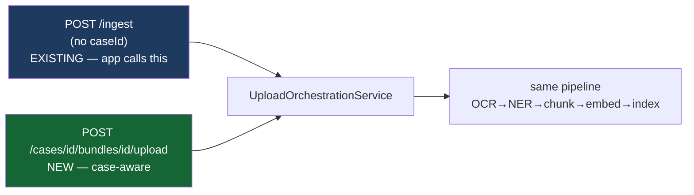

# NOTARIST — Phase 5: API Proposal (DESIGN ONLY)

| Field | Value |
|---|---|
| Status | PROPOSAL — no controller written |
| Hard constraint | **Backward compatibility. The React Native app (Claude 2) must not break.** |
| Date | 2026-07-14 |

---

## 1. The compatibility contract

Six endpoints are **actively called by the shipped mobile app** (verified in `frontend/NotaristApp/src/api/`).
These are load-bearing and may not change shape, status codes, or response envelope:

| Endpoint | Called from | Consequence if changed |
|---|---|---|
| `POST /api/v1/auth/login` | `api/auth.js` | Nobody can sign in |
| `POST /api/v1/auth/refresh` | `api/client.js` interceptor | Silent mass logout |
| `POST /api/v1/auth/logout` | `api/auth.js` | Sessions leak |
| `GET /api/v1/documents` | Documents tab **+ Profile stat** | Two screens break |
| `POST /api/v1/ingest` → `/{jobId}/confirm` → `/{id}/status` | Upload flow | Upload breaks |
| `POST /api/v1/assistant/ask` | Assistant tab | Chat breaks |

> The response envelope `ApiResponse<T>{ meta, data, error }` and `PageResponse<T>{ items, page }` are
> part of this contract — the app destructures `response.data.data.page.totalElements` directly.

---

## 2. Full endpoint inventory & disposition

Legend: **KEEP** (unchanged) · **EXTEND** (additive, compatible) · **REPLACE** (new preferred form,
old one aliased) · **DEPRECATE** (sunset with notice) · **FUTURE** (new).

### 2.1 Auth — `notarist-auth`

| Endpoint | Disposition | Notes |
|---|---|---|
| `POST /api/v1/auth/login` | **KEEP** | Auth flow explicitly out of scope |
| `POST /api/v1/auth/refresh` | **KEEP** | |
| `POST /api/v1/auth/logout` | **KEEP** | |
| `GET /api/v1/auth/me` | **FUTURE** | Requested by frontend (Sprint 1 found no source for email/avatar). Cheap: claims already exist. |

### 2.2 Documents — `notarist-document`

| Endpoint | Disposition | Notes |
|---|---|---|
| `GET /api/v1/documents` | **EXTEND** | Add **optional** `caseId` / `bundleId` filter params. No param ⇒ identical behaviour to today. |
| `GET /api/v1/documents/{id}` | **EXTEND** | Response gains optional `caseId`, `bundleId`. Additive JSON fields are safe — the app ignores unknown keys. |
| `GET /api/v1/documents/stats` | **FUTURE** | Sprint 1 found Home fabricated its status breakdown because this doesn't exist. Would let the app show real per-status counts. |

### 2.3 Ingestion — `notarist-ingest`

| Endpoint | Disposition | Notes |
|---|---|---|
| `POST /api/v1/ingest` | **EXTEND** | Optional `caseId` + `bundleId` in the request body. Absent ⇒ today's case-less document. **Contract unchanged.** |
| `POST /api/v1/ingest/{jobId}/confirm` | **KEEP** | |
| `GET /api/v1/ingest/{ingestionId}/status` | **KEEP** | |

### 2.4 Search & Assistant

| Endpoint | Disposition | Notes |
|---|---|---|
| `POST /api/v1/search` | **EXTEND** | Optional `caseId` scope filter + honours the new answer router (Phase 6). |
| `POST /api/v1/assistant/ask` | **EXTEND** | Optional `caseId` context. **Envelope must not change** (`answerText`/`citations`/`confidence`) — see risk below. |
| `POST /api/v1/assistant/ask/stream` | **KEEP** | SSE; frontend has not implemented it yet (deferred sprint). |
| `GET /api/v1/assistant/history/{sessionId}` | **KEEP** | |

> ⚠️ **Behavioural (not contractual) change.** Under Phase 6 routing, a status/numeric question sent
> to `/assistant/ask` will be answered deterministically from SQL instead of by the LLM. The JSON
> shape is identical, so the app will not break — but the *answer* changes (it becomes correct). This
> is the intended outcome; flagging it because it is a semantic change to a shipped endpoint.

### 2.5 Ops — `notarist-observability`

`GET /ops/health|live|ready`, `POST /ops/replay/queue|dlq`, `POST /ops/reindex`,
`GET /ops/consistency/*` → **KEEP** all. Operational surface, not a product API.

---

## 3. New Case API (FUTURE)

All under `/api/v1`, all returning the existing `ApiResponse<T>` envelope, all tenant-scoped by RLS.

### 3.1 Case lifecycle

```http
POST   /api/v1/cases                      # create → CASE_CREATED
GET    /api/v1/cases                      # list (filter: state, type, assignedTo) → PageResponse
GET    /api/v1/cases/{caseId}             # detail incl. bundles + progress
PATCH  /api/v1/cases/{caseId}             # metadata only (title, assignee) — NOT state
DELETE /api/v1/cases/{caseId}             # → CANCELLED (soft; never a hard delete)
```

### 3.2 Bundles & upload — *the endpoint from your brief*

```http
POST   /api/v1/cases/{caseId}/bundles                    # create bundle
GET    /api/v1/cases/{caseId}/bundles
POST   /api/v1/cases/{caseId}/bundles/{bundleId}/upload  # ← the case-aware upload
DELETE /api/v1/cases/{caseId}/bundles/{bundleId}/documents/{documentId}
```

### 3.3 Workflow, verification, QC, approval, delivery

```http
GET    /api/v1/cases/{caseId}/timeline      # projection over audit_trail — NOT a new store
GET    /api/v1/cases/{caseId}/workflow      # domain transition history

POST   /api/v1/cases/{caseId}/verify        # {decision: ACCEPT|REJECT, reason} → VERIFIED | UPLOADING
POST   /api/v1/cases/{caseId}/draft         # → GENERATING_DRAFT
GET    /api/v1/cases/{caseId}/qc            # checklist + failed items
POST   /api/v1/cases/{caseId}/qc/rerun      # → re-evaluate

GET    /api/v1/approvals                    # "what awaits MY signature" (cross-case; role-filtered)
GET    /api/v1/approvals/{approvalId}
POST   /api/v1/approvals/{approvalId}/decide   # {decision, reason} — NOTARIS only for NOTARY_SIGNATURE

POST   /api/v1/cases/{caseId}/deliver       # FINALIZED → DELIVERED
POST   /api/v1/cases/{caseId}/archive       # DELIVERED → ARCHIVED

GET    /api/v1/cases/{caseId}/reminders
POST   /api/v1/cases/{caseId}/reminders
```

**State is never mutated by a generic `PATCH {state: …}`.** Each transition is an **intent-named
endpoint** (`/verify`, `/draft`, `/deliver`) so the API cannot express an illegal jump, authority is
checkable per action, and the audit entry records *what the user meant*, not just a field diff. A
`PATCH state` endpoint would push state-machine enforcement into request validation, where it will
eventually be bypassed.

---

## 4. The compatibility strategy for upload

Your brief says:

```
POST /documents/upload   →   POST /cases/{id}/bundle/upload    (maintain compatibility)
```

Note first: **`POST /documents/upload` does not exist today.** The real upload flow is the 3-step
ingest handshake (`POST /ingest` → signed URL → `PUT` to GCS → `POST /ingest/{jobId}/confirm`). The
compatibility story is therefore about `/ingest`, and it is simpler than a redirect:



Both entry points delegate to **the same** `UploadOrchestrationService`. The new one passes a
`caseId`/`bundleId`; the old one passes null. There is **no duplicated upload logic, no proxy, no
redirect, and no version fork** — one service, two doors. The legacy door stays open indefinitely
(documents genuinely may exist without a case), so `/ingest` is **EXTEND**, never **DEPRECATE**.

---

## 5. Deprecation policy

Nothing is deprecated in this sprint. When something eventually is:

1. Announce via response header `Deprecation: true` + `Sunset: <date>` (RFC 8594).
2. Keep serving for ≥2 app release cycles — the mobile app cannot be force-upgraded.
3. Log usage per endpoint (`search_query_log` shows the pattern) to prove it's unused before removal.

**Explicitly NOT deprecated:** `GET /documents`. A document-centric view remains legitimate — a notary
still browses "all my aktas" without thinking about cases.

---

## 6. Risk register

| Risk | Severity | Mitigation |
|---|---|---|
| `POST /assistant/ask` answer semantics change under routing | **Medium** | Envelope unchanged; only correctness improves. Verify against the app before release. |
| Additive response fields break a strict client | Low | The RN app ignores unknown JSON keys (verified — it destructures named fields). |
| `caseId` becomes mandatory by accident | **High** | Every new field/column is nullable. Enforced by review, not convention. |
| `DuplicateDetector` behaviour change (R1) | **High** | Product decision required before implementation. Not resolved in this sprint. |
