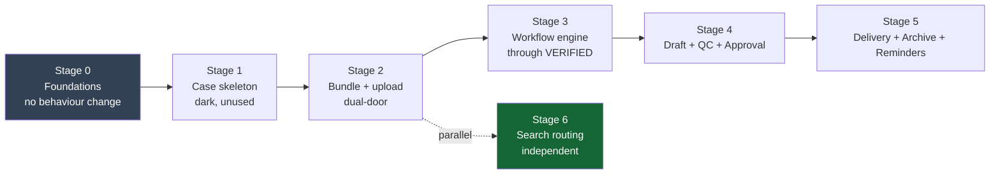

# NOTARIST — Migration Strategy (DESIGN ONLY)

| Field | Value |
|---|---|
| Status | PROPOSAL — nothing implemented, nothing committed |
| Principle | **Strangler-fig, additive-only. No big-bang refactor.** |
| Date | 2026-07-14 |

---

## 1. Governing principles

1. **Additive only.** Every new column and field is nullable. Zero destructive DDL. Zero data
   backfill required for the system to keep running.
2. **The existing pipeline is untouchable.** `notarist-ingest` (OCR/NER/chunk/embed/index workers,
   DLQ, retry, generation guards) is the most intricate code in the backend and is explicitly out of
   scope. It gains *context propagation* and *one outbound event* — nothing else.
3. **Case wraps; it does not rewrite.** Documents keep their aggregate root, their lifecycle, and
   their APIs. Case sits **above** them.
4. **Every stage ships green.** Each stage below leaves the system compiling, deployable, and with the
   mobile app fully working. There is no "temporarily broken" window.
5. **RLS at creation time**, never retrofitted (report R2).

---

## 2. Blocking decisions — needed before Stage 2

These are **product decisions I should not make unilaterally**. Implementation of the Case model
cannot start until they are answered.

| # | Decision | Why it blocks | Recommendation |
|---|---|---|---|
| **D1** | Can the same physical file belong to multiple cases? | `uq_dokumen_checksum_tenant` currently forbids it. This determines whether `DuplicateDetector` must change from "reject duplicate" to "link existing document". | **Yes** — keep the constraint, add `bundle_document` M:N. One blob, OCR'd once, linked N times. Best storage + cost profile, satisfies "never duplicate data". |
| **D2** | Is `GET /documents` (case-less browsing) permanently supported? | Determines whether `case_id` can *ever* become `NOT NULL`. | **Yes, permanently.** Notaries browse aktas directly. `case_id` stays nullable forever. |
| **D3** | Who may perform QC — the drafting staff, or a second person? | Four-eyes principle changes the `Approval` model (`QC_SIGNOFF` may need a distinct actor from the drafter). | Enforce four-eyes: `qc_signoff.decided_by <> draft.created_by`. Standard for legal instruments. |
| **D4** | Does draft generation use the LLM? | Phase 6 forbids LLM for *factual/status* queries but drafting is generative. Affects the Runtime boundary (out of scope for me to change). | LLM may draft **prose**, but every *fact* (names, NIK, nomor akta, dates) must be injected from verified extracted fields — never generated. QC then validates fact-by-fact. |

---

## 3. Staged rollout

### Stage 0 — Foundations (no behaviour change)
- Add `CaseId`, `CaseState`, `CaseNumber`, … value objects to `notarist-core`.
- Widen audit vocabulary: `event_category += CASE`, `subject_type += CASE|BUNDLE|APPROVAL`.
  **No DDL** — both are `VARCHAR` (report F5).
- Create the empty `notarist-case` Gradle module; wire it into `settings.gradle.kts` and
  `notarist-web`.
- **Ships green. Zero runtime change.** Nothing calls any of it yet.

### Stage 1 — Case skeleton (dark)
- Migration **V10**: create `notaris_case`, `bundle`, `bundle_document`, `case_workflow` **+ RLS
  policies in the same migration**.
- Implement the `Case` aggregate and `CaseStateMachine` (invariants **inside** the aggregate — do not
  repeat the `DocumentLegal` static-helper mistake, report R3).
- Unit-test the state machine exhaustively: every allowed transition, every forbidden one, terminal
  states, rollback edges, role gates. **This is the highest-value test surface in the sprint.**
- API: `POST/GET /cases` only. Feature-flagged off.
- **Ships green. Existing APIs untouched.**

### Stage 2 — Bundles + case-aware upload *(requires D1)*
- Migration **V11**: additive nullable columns on `dokumen_legal`, `ingestion_job`, `chunk_index`.
- `POST /cases/{id}/bundles/{id}/upload` delegates to the **same** `UploadOrchestrationService` as
  `POST /ingest` (API proposal §4). Legacy door stays open.
- `notarist-ingest` change (the only one): echo `caseId`/`bundleId` from the job payload and emit
  `BundleIngestionCompletedEvent` when a bundle's documents all reach `COMPLETED`.
- **Highest-risk stage** — it touches ingest and depends on the D1 resolution.
- **Verification gate:** the mobile app's existing upload flow must be exercised end-to-end and still
  work *before* this stage is considered done.

### Stage 3 — Workflow through VERIFIED
- `CASE_CREATED → UPLOADING → OCR_RUNNING → FIELD_EXTRACTION → WAITING_VERIFICATION → VERIFIED`.
- `IngestionCompletedListener` advances the case (event-driven; no `case → ingest` dependency).
- Timeline endpoint as a **projection over `audit_trail`** — no new store.
- Human verification endpoint + rollback to `UPLOADING`.

### Stage 4 — Draft, QC, Approval *(requires D3, D4)*
- Migration **V12**: `approval`, `qc_checklist`, `qc_item` + RLS.
- Draft generation, QC ruleset (versioned), notary approval with role gate from **existing** JWT
  claims.
- Rollback edges: `QC_FAILED → GENERATING_DRAFT | WAITING_VERIFICATION`.

### Stage 5 — Delivery, Archive, Reminders
- Migration **V13**: `reminder` + RLS.
- `ReminderScheduler` (mirror the existing `IngestionQueueScheduler` pattern — do not invent a new
  scheduling mechanism).
- Terminal states, retention → `ARCHIVED`.

### Stage 6 — Search routing *(parallel; independent of Case)*
This stage is **decoupled** from the Case work and is arguably the highest-value item in the whole
backlog, because it fixes a correctness/liability bug that exists **today**:

- Implement `AnswerRouter` + `FactualQueryGuard` (report §3.3).
- Route numeric / status / aggregation queries to **SQL**; never to the LLM.
- Implement the `RetrievalPipeline` strategy interface that currently has **zero implementations**,
  or delete it and route explicitly.
- **Can start immediately** — it does not wait on D1–D4.

---

## 4. Backward-compatibility test gate

Every stage must pass this before merge. These are the app's real call paths:

| # | Check |
|---|---|
| 1 | `POST /auth/login` → token issued; app signs in |
| 2 | `GET /documents` (no `caseId`) → identical payload to pre-change baseline |
| 3 | `GET /documents` → `data.page.totalElements` present (Profile stat + Home tile depend on it) |
| 4 | `POST /ingest` (no `caseId`) → signed URL → `PUT` → `/confirm` → `/status` reaches `COMPLETED` |
| 5 | `POST /assistant/ask` → `{answerText, citations, confidence}` envelope unchanged |
| 6 | Legacy documents (`case_id IS NULL`) still list, retrieve, and answer |
| 7 | RLS: a user in tenant A cannot read tenant B's case, bundle, approval, or reminder |

> Item 7 is not a formality. RLS on the new tables is the *only* thing standing between a
> multi-tenant notary platform and a cross-tenant leak of confidential legal instruments.

---

## 5. Rollback plan

Every stage is revertible because every change is additive:

| Stage | Revert |
|---|---|
| 0–1 | Drop the new tables. No existing table touched. |
| 2 | Columns are nullable — leave them in place, unused. Disable the case upload route. |
| 3–5 | Feature-flag the case endpoints off. The document/ingest path never depended on them. |
| 6 | Router falls back to today's single hybrid pipeline. |

No stage requires a data backfill, so no stage requires a data *rollback*.

---

## 6. Technical debt logged (not fixed in this sprint)

| # | Debt | Severity |
|---|---|---|
| T1 | `database/postgres/flyway/` is a **stale duplicate** of the real migrations in `notarist-infra`. A migration written there is silently ignored. | **High — trap** |
| T2 | RLS on only 3 of 13 tables (`document_chunk`, `chunk_index`, `audit_trail`, queues unprotected) | **High** |
| T3 | `DocumentLegal` invariants are unimplemented `TODO`s; the state machine is bypassable | Medium |
| T4 | `RetrievalPipeline` strategy interface has zero implementations (dead code) | Medium |
| T5 | Three overlapping status enums; `PipelineStage` is documented as replaced but still compiled | Medium |
| T6 | `database/oracle/` Liquibase changelogs remain, though Oracle was removed | Low |

---

## 7. What was produced

| Deliverable | File |
|---|---|
| Architecture report (Phases 1, 3, 6) | `01-architecture-report.md` |
| UML + package structure (Phase 2) | `02-uml-and-packages.md` |
| Database proposal (Phase 4) | `03-database-proposal.md` |
| API proposal (Phase 5) | `04-api-proposal.md` |
| Migration strategy | `05-migration-strategy.md` |

**No code implemented. No migrations written. No commits. Working tree left dirty.**
