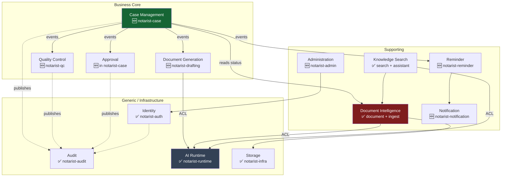

# 02 — Bounded Contexts

| Field | Value |
|---|---|
| Status | DESIGN ONLY |
| Rule | Reuse existing Gradle modules. A new context is only created where no module can host it. |

---

## 0. Context map



**Relationship types:** Case Management is **upstream** of QC/Approval/Drafting (they conform to its
events). Document Intelligence is **upstream** of Search. AI Runtime and Storage are accessed only
through an **anti-corruption layer** (ports) — no context depends on a model or a bucket directly.

---

## 1. Identity ✅ EXISTS — `notarist-auth`

- **Purpose:** Authenticate humans; assert who they are and what they may do.
- **Responsibilities:** Login, JWT issuance/refresh/revocation, role assignment, tenant binding,
  RLS context establishment per request.
- **Aggregates:** `User` (root), `Session`, `Role` *(all exist)*
- **Repositories:** `UserRepository` ✅
- **Ports:** *(inbound)* `AuthenticateUserUseCase` ✅ · *(outbound)* `TokenDenyListRepository` ✅
- **Events published:** `UserAuthenticated`, `UserLoggedOut` *(already audited)*
- **External deps:** PostgreSQL
- **Change in this program:** ⚠️ **None to the auth flow.** Case/Approval consume the **existing** JWT
  claims (`roles`, `tenantId`, `sub`). No new claim is required. See `08-rbac.md` for the one open
  question (the brief's six roles vs the five that exist).

---

## 2. Case Management 🆕 — `notarist-case`

- **Purpose:** Own the business workflow of notarial work. **The new core.**
- **Responsibilities:** Case lifecycle and state machine; bundle composition; deadlines; exceptions
  and escalation; delivery; repertorium numbering; orchestration of QC/Approval/Drafting via events.
- **Explicitly NOT responsible for:** OCR, chunking, embedding, indexing, or any document machine
  state. It **observes** those, never drives them.
- **Aggregates:** `Case` (root), `Bundle` (entity), `Workflow` (entity), `Exception` (entity),
  `Deadline` (VO), `Repertorium` (root — see below)
- **Repositories:** `CaseRepository`, `BundleRepository`, `RepertoriumRepository`
- **Ports:**
  - *inbound:* `CreateCaseUseCase`, `TransitionCaseUseCase`, `AttachDocumentUseCase`,
    `DeliverBundleUseCase`
  - *outbound:* `DocumentStatusPort` (read document pipeline state), `CaseTimelinePort` (read audit
    projection), `EventPublisher`
- **Events published:** `CaseCreated`, `BundleCreated`, `BundleLocked`, `CaseTransitioned`,
  `VerificationCompleted`, `BundleDelivered`, `CaseArchived`, `DeadlineMissed`, `ExceptionRaised`
- **Events consumed:** `DocumentIngestionCompleted`, `DraftGenerated`, `QCCompleted`,
  `ApprovalGranted`, `ApprovalRejected`
- **External deps:** PostgreSQL only. **No dependency on `notarist-ingest`** (see §12).

> **Repertorium is its own aggregate root**, not a field on Case. It is a gapless, sequential,
> statutory register — allocation must be serialized independently of any case transaction.

---

## 3. Document Intelligence ✅ EXISTS — `notarist-document` + `notarist-ingest`

- **Purpose:** Turn a file into trustworthy, structured, searchable knowledge.
- **Responsibilities:** Upload orchestration, checksum/dedup, OCR, OCR-confidence policy, NER field
  extraction, chunking, embedding, indexing, DLQ/retry — **plus (new) human Verification of extracted
  fields.**
- **Aggregates:** `DocumentLegal` (root ✅ — **stays a root**), `IngestionJob` (root ✅),
  `ChunkMetadata` ✅, `ExtractedField` 🆕, `Verification` 🆕
- **Repositories:** `DocumentLegalRepository` ✅, `IngestJobRepository` ✅, `ChunkMetadataRepository` ✅,
  `DeadLetterRepository` ✅, `VerificationRepository` 🆕
- **Ports:** `OcrServicePort` ✅, `NerServicePort` ✅, `EmbeddingPort` ✅, `VectorIndexPort` ✅,
  `DocumentStoragePort` ✅ — **all already exist; none is replaced**
- **Events published:** `DocumentUploaded` ✅, `OcrCompleted` ✅, `NerCompleted` ✅,
  `ChunkingCompleted` ✅, `EmbeddingCompleted` ✅, `IndexingCompleted` ✅, plus 🆕
  `ExtractionCompleted`, `DocumentIngestionCompleted`, `VerificationRequested`
- **External deps:** GCS (via `DocumentStoragePort`), OCR provider, NER, embedding, Qdrant
- **Change:** **Additive only.** It gains (a) case context carried in the existing job `payload`
  JSONB, (b) one upward event, (c) the Verification sub-domain. The pipeline itself is untouchable.

> **Why Verification lives here, not in Case Management:** verification is about *whether the machine
> read the document correctly* — it is document knowledge, and it reuses the existing
> `OcrReviewStatus.LOW_CONFIDENCE_REVIEW` signal. Case Management only cares about the *verdict*.

---

## 4. Document Generation 🆕 — `notarist-drafting`

- **Purpose:** Produce a Draft deed from a Template and verified facts.
- **Responsibilities:** Template and Legal Clause authoring/versioning; fact binding; draft rendering;
  draft versioning; regeneration after rejection.
- **Aggregates:** `Template` (root), `LegalClause` (root), `Draft` (root)
- **Repositories:** `TemplateRepository`, `ClauseRepository`, `DraftRepository`
- **Ports:** *outbound:* `LlmPort` (⚠️ **the existing `RegistryLlmPort` in `notarist-runtime` — do not
  create a new LLM abstraction**), `DocumentStoragePort` ✅ (persist the rendered draft as a
  `DocumentLegal`), `VerifiedFactPort` (read verified extraction)
- **Events published:** `DraftGenerated`, `DraftGenerationFailed`, `TemplatePublished`,
  `ClauseVersioned`
- **Events consumed:** `VerificationCompleted`, `DraftRejected` (→ regenerate)
- **External deps:** AI Runtime (via ACL), Storage
- **Invariant (non-negotiable):** **facts are injected, never generated.** Every NIK, name, nomor,
  date and amount is bound from a verified `ExtractedField`. The LLM composes prose only. A draft
  whose facts came from a model is a forgery risk, not a feature.

---

## 5. Knowledge Search ✅ EXISTS — `notarist-search` + `notarist-assistant`

- **Purpose:** Answer questions over the office's knowledge.
- **Responsibilities:** Intent classification, **answer routing** (🆕), BM25 + vector retrieval, RRF
  fusion, security filtering, reranking, grounding, citation, RAG orchestration.
- **Aggregates:** none (stateless query context). `SearchQuery`, `RetrievalResult`, `Citation` are VOs ✅
- **Ports:** `VectorSearchPort` ✅, `KeywordSearchRepository` ✅, `RerankerPort` ✅,
  `QueryEmbeddingPort` ✅, `LlmPort` ✅, 🆕 `CaseFactPort` (deterministic SQL answers)
- **Events published:** `SearchExecuted`, `AiResponseGenerated` ✅
- **External deps:** Qdrant, PostgreSQL FTS, AI Runtime
- **Change:** 🆕 `AnswerRouter` + `FactualQueryGuard`. **Numeric, status and aggregation queries route
  to SQL and never reach the LLM** — currently they all do (`RetrievalPipeline` has zero
  implementations; intent is classified and then ignored).

---

## 6. Quality Control 🆕 — `notarist-qc`

- **Purpose:** Prove a Draft is correct **before** it consumes a notary's attention.
- **Responsibilities:** Versioned rulesets; deterministic evaluation of a Draft against verified
  facts; blocking vs warning severity; QC verdicts.
- **Aggregates:** `QcChecklist` (root), `QcItem` (VO), `QcRuleSet` (root, versioned)
- **Repositories:** `QcChecklistRepository`, `QcRuleSetRepository`
- **Ports:** *outbound:* `VerifiedFactPort`, `DraftContentPort`
- **Events published:** `QCStarted`, `QCCompleted` (`PASSED`/`FAILED`), `QCRuleSetPublished`
- **Events consumed:** `DraftGenerated`
- **External deps:** **none — deliberately.** QC touches no AI, no network, no model.
- **Invariant:** **QC is deterministic.** Same draft + same facts + same ruleset ⇒ same verdict,
  always. No LLM. A probabilistic QC gate is worse than none, because it manufactures false confidence.
- **Why a separate module:** QC must be independently testable and auditable. A regulator may ask
  "what rules did you apply on this date?" — that answer must not be entangled with case orchestration.

---

## 7. Approval 🆕 — inside `notarist-case`

- **Purpose:** Attach human legal responsibility to a decision.
- **Responsibilities:** Raise approval requests against a **role**; record decisions with actor,
  timestamp, reason; enforce authority; enforce four-eyes where required.
- **Aggregates:** `Approval` (root)
- **Repositories:** `ApprovalRepository`
- **Ports:** *inbound:* `DecideApprovalUseCase` · *outbound:* `RoleAuthorityPort` (reads JWT claims ✅)
- **Events published:** `ApprovalRequested`, `ApprovalGranted`, `ApprovalRejected`
- **External deps:** Identity (claims only)
- **Placement note:** Approval is a **separate aggregate** (queried cross-case: *"what awaits my
  signature?"*) but lives **inside the `notarist-case` module**. It has no meaning without cases, and
  a separate Gradle module would buy nothing but a dependency edge. *Bounded context ≠ Gradle module.*

---

## 8. Reminder 🆕 — `notarist-reminder`

- **Purpose:** Stop cases dying in waiting states.
- **Responsibilities:** Schedule reminders against human-gate states; auto-cancel on state exit;
  deadline tracking; escalation on repeated non-response.
- **Aggregates:** `Reminder` (root)
- **Repositories:** `ReminderRepository`
- **Ports:** *outbound:* `NotificationPort`, `CaseStatePort` (verify the gate is still open)
- **Events published:** `ReminderTriggered`, `ReminderCancelled`, `DeadlineApproaching`
- **Events consumed:** `CaseTransitioned` (→ schedule/cancel)
- **External deps:** Notification
- **Reuse:** the scheduler mirrors the existing `IngestionQueueScheduler` + `ingestion_queue` dequeue
  pattern (`WHERE status='SCHEDULED' AND due_at <= now()`). **Do not invent a new scheduling mechanism.**

---

## 9. Notification 🆕 — `notarist-notification`

- **Purpose:** Deliver a message to a human, on some channel.
- **Responsibilities:** Channel abstraction (in-app, email, push), delivery attempts, read state.
- **Aggregates:** `Notification` (root)
- **Repositories:** `NotificationRepository`
- **Ports:** *outbound:* `EmailChannelPort`, `PushChannelPort`, `InAppChannelPort`
- **Events published:** `NotificationSent`, `NotificationFailed`
- **Events consumed:** `ReminderTriggered`, `ApprovalRequested`, `ExceptionEscalated`
- **External deps:** email/push providers
- ⚠️ **Frontend dependency:** the mobile app already ships a complete Notification UI (list, unread
  badge, empty/error states) behind a `NotificationService` seam with `FEATURES.notificationsEndpoint
  = false`. **This context's API is the missing backend** it is waiting for. Building it flips one
  frontend flag — no frontend rework.

---

## 10. Administration 🆕 — `notarist-admin`

- **Purpose:** Manage the office's master data and configuration.
- **Responsibilities:** PERSON_MASTER (clients, directors, guarantors), Collateral registry, Bank
  Partners, office/tenant settings, user provisioning.
- **Aggregates:** `Person` (root), `Collateral` (root), `Organization` (root)
- **Repositories:** `PersonRepository`, `CollateralRepository`, `OrganizationRepository`
- **Ports:** *inbound:* CRUD use cases
- **Events published:** `PersonCreated`, `PersonMerged`, `CollateralRegistered`
- **External deps:** PostgreSQL
- **Reuse:** `PersonId` ✅ already exists in `notarist-core`.
- **Why separate from Case:** a Person outlives every case they appear in. Master data churns on a
  different clock than workflow.

---

## 11. AI Runtime ✅ EXISTS — `notarist-runtime` — ⛔ DO NOT MODIFY

- **Purpose:** Provide inference capability behind a stable abstraction.
- **What exists (respect it):** `InferenceProvider`, `EmbeddingProvider`, `RerankerProvider`,
  `OcrProvider` SPI, `ModelRegistry`, `RuntimeCapabilityDetector`, `RuntimeDegradationManager`,
  queue isolation per workload, timeout/cancellation orchestration, GPU awareness.
- **Ports (already defined):** `RegistryLlmPort`, `RegistryRerankerPort`, `OcrProvider`,
  `EmbeddingProvider`
- **Rule:** **Every context consumes AI only through these ports.** Document Generation must use the
  existing `RegistryLlmPort`. Creating a second LLM abstraction for drafting would fork the runtime's
  degradation, timeout and queue-isolation guarantees — the exact failure this module was built to
  prevent.

---

## 12. Storage ✅ EXISTS — `notarist-infra`

- **Purpose:** Persist bytes and vectors.
- **What exists:** `DocumentStoragePort` ✅ + `GcsDocumentStorageAdapter` ✅, Qdrant client/adapter ✅,
  Postgres connection + RLS context ✅.
- **Rule:** No context touches GCS or Qdrant directly. Drafting persists rendered deeds through the
  **existing** `DocumentStoragePort`.

---

## 13. Audit ✅ EXISTS — `notarist-audit`

- **Purpose:** Immutable record of everything.
- **What exists:** `AuditEntry`, `AuditEventType`, `AuditOutcome`, `AuditTrailRepository`,
  `AuditEventListener`, and a **polymorphic** `audit_trail` table (`subject_type` / `subject_id` /
  `detail_json`).
- **Change:** **vocabulary only.** `subject_type` gains `CASE|BUNDLE|APPROVAL|DRAFT|QC`;
  `event_category` gains `CASE`. Both are `VARCHAR` ⇒ **zero DDL**.
- **Timeline** is a **read-model projection** over this table, not a new store.

---

## 14. Integration rules

### 14.1 The one dependency that must never exist

```
notarist-ingest  ──X──▶  notarist-case      ❌ FORBIDDEN
notarist-case    ──X──▶  notarist-ingest    ❌ FORBIDDEN
```

The machine pipeline must never know what a Case is, and the Case must never call the pipeline
synchronously. They communicate **only** by domain events over the existing Spring event bus (the
pattern `IngestionEventPublisher` → `AuditEventListener` already establishes):

```
ingest  ──▶ DocumentIngestionCompleted (carries caseId echoed from job payload) ──▶ case listens
```

`notarist-ingest` stays ignorant: it echoes back the `caseId` it was handed in the existing
`ingestion_queue.payload` JSONB. Any direct call in either direction creates a cycle and couples the
human workflow to worker throughput.

### 14.2 Anti-corruption layers

| Boundary | ACL | Why |
|---|---|---|
| any → AI Runtime | `LlmPort` / `EmbeddingProvider` / `OcrProvider` | model choice must not leak into the domain |
| any → Storage | `DocumentStoragePort` | GCS must not leak into the domain |
| Case → Document | `DocumentStatusPort` (read-only) | Case reads pipeline status; it can never write it |
| Drafting → Verification | `VerifiedFactPort` | drafting consumes only *verified* facts, never raw OCR |

### 14.3 Module ≠ context

Some contexts share a Gradle module deliberately:

| Context | Module | Reason |
|---|---|---|
| Case Management + Approval | `notarist-case` | Approval is meaningless without cases |
| Document Intelligence | `notarist-document` + `notarist-ingest` | already two modules; keep them |
| Knowledge Search | `notarist-search` + `notarist-assistant` | already two modules; keep them |

**New Gradle modules proposed: 5** — `notarist-case`, `notarist-qc`, `notarist-drafting`,
`notarist-reminder`, `notarist-notification`, `notarist-admin` *(6 including admin — sequence in
`10-implementation-roadmap.md`)*.
