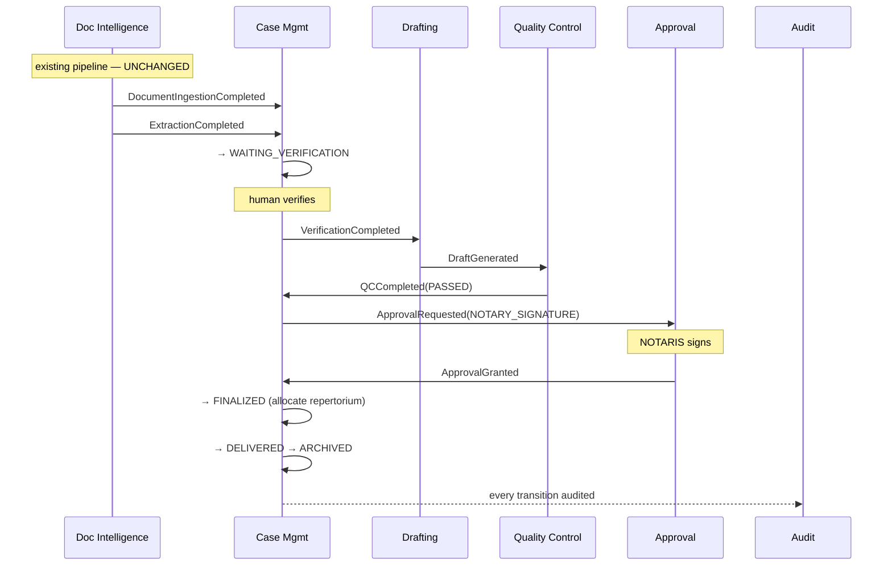

# 04 — Domain Events

| Field | Value |
|---|---|
| Status | DESIGN ONLY |
| Transport | ✅ **Existing Spring `ApplicationEventPublisher`** (the pattern `IngestionEventPublisher` → `AuditEventListener` already establishes). No message broker is introduced. |
| Base type | ✅ `com.notarist.core.domain.event.DomainEvent` — **exists; reuse** |

---

## 0. Event design rules

1. **Events are facts, in the past tense.** `DraftGenerated`, never `GenerateDraft` (that's a command).
2. **Payloads carry identity + the minimum needed to react** — never whole aggregates. A consumer that
   needs more loads it. Fat events go stale in flight.
3. **Every event carries** `eventId`, `occurredAt`, `tenantId`, `correlationId` ✅ (`CorrelationId`
   already exists in core), and `actorUserId` (nullable for system actors).
4. **Idempotency key = `eventId`.** Consumers must be safe to replay. With at-least-once delivery,
   duplicate delivery is normal, not exceptional.
5. **Ordering is guaranteed only per aggregate instance**, never globally.

---

## 1. Existing events ✅ — reuse, do not redefine

Already implemented in `notarist-ingest`:

| Event | Producer | Status |
|---|---|---|
| `DocumentUploadedEvent` | ingest | ✅ exists |
| `OcrCompletedEvent` | ingest | ✅ exists |
| `NerCompletedEvent` | ingest | ✅ exists |
| `ChunkingCompletedEvent` | ingest | ✅ exists |
| `EmbeddingCompletedEvent` | ingest | ✅ exists |
| `IndexingCompletedEvent` | ingest | ✅ exists |
| `AiResponseGeneratedEvent`, `CitationCreatedEvent` | assistant | ✅ exists |

These are **internal pipeline events**. Case Management does **not** subscribe to them individually —
subscribing to `OcrCompletedEvent` per document would couple the business workflow to worker
mechanics. It subscribes to **one** new aggregate-level event instead (§2.1).

---

## 2. New events

### 2.1 `DocumentIngestionCompleted` 🆕 — **the bridge event**

The single most important new event: it is the **only** link from the machine pipeline to the human
workflow.

| Field | Value |
|---|---|
| **Producer** | Document Intelligence (`notarist-ingest`) |
| **Consumers** | Case Management (`IngestionCompletedListener`) |
| **Payload** | `documentId`, `caseId?`, `bundleId?`, `finalStatus` (`INDEXED`\|`DLQ`), `ocrReviewStatus`, `tenantId`, `correlationId` |
| **Idempotency** | `eventId`; consumer is idempotent — re-delivering a completed document must not re-transition a Case |
| **Ordering** | per document |
| **Retry** | 3× exponential backoff → DLQ (reuse the **existing** `DeadLetterRepository`) |

`caseId` / `bundleId` are **echoed** from the existing `ingestion_queue.payload` JSONB. `notarist-ingest`
does not know what a Case *is* — it just returns the context it was handed. This is what keeps the
forbidden dependency (§`02-bounded-contexts.md` §14.1) from ever being needed.

> **Emission rule:** fired **once per document** on reaching a terminal pipeline state. Case
> Management decides whether the *bundle* is now complete by querying the remaining documents — it
> does **not** rely on the pipeline to count for it (the pipeline must stay ignorant of bundles).

---

### 2.2 Case Management events

| Event | Producer | Consumers | Payload | Idempotency | Retry |
|---|---|---|---|---|---|
| `CaseCreated` | Case | Audit, Reminder | `caseId, caseNumber, caseType, clientId, tenantId, actor` | `eventId` | 3× → DLQ |
| `BundleCreated` | Case | Audit | `bundleId, caseId, bundleType, expectedCount` | `eventId` | 3× |
| `DocumentAttachedToBundle` | Case | Audit | `bundleId, documentId, roleInBundle` | natural key `(bundleId, documentId)` — re-attach is a **no-op**, not an error | 3× |
| `CaseTransitioned` | Case | Audit, Reminder, Notification | `caseId, fromState, toState, transitionKind (FORWARD\|RETRY\|ROLLBACK\|CANCEL), reason?, actor` | `eventId` | 3× |
| `BundleLocked` | Case | Audit | `bundleId, caseId, documentIds[], lockedBy` | `eventId` | 3× |
| `VerificationCompleted` | Doc Intelligence | Case, Drafting, Audit | `documentId, caseId?, verificationId, outcome (VERIFIED\|REJECTED), verifiedBy` | `eventId` | 3× |
| `ExceptionRaised` | Case | Notification, Audit | `caseId, exceptionType, severity, raisedBy` | `eventId` | 3× |
| `ExceptionEscalated` | Case | Notification, Audit | `caseId, escalatedTo (role), reason` | `eventId` | 3× |
| `DeadlineApproaching` | Reminder | Notification | `caseId, deadlineType, dueAt` | `(caseId, deadlineType, dueAt)` | 3× |
| `DeadlineMissed` | Case | Notification, Audit | `caseId, deadlineType, dueAt` | `(caseId, deadlineType)` — **fires once, ever** | 3× |
| `BundleDelivered` | Case | Audit, Notification | `bundleId, caseId, recipient, channel, deliveredAt` | `eventId` | 3× |
| `CaseArchived` | Case | Audit | `caseId, archivedAt` | `eventId` | 3× |
| `RepertoriumNumberAllocated` | Case | Audit | `caseId, nomorAkta, sequence, notarisId, year` | **`caseId` — allocation is once-only, enforced by the aggregate** | ⚠️ **NO RETRY** (see §4) |

---

### 2.3 Document Intelligence events (new)

| Event | Producer | Consumers | Payload | Idempotency | Retry |
|---|---|---|---|---|---|
| `ExtractionCompleted` | Doc Intelligence | Verification, Case | `documentId, caseId?, fields[] (name, value, confidence, span), overallConfidence` | `eventId` | 3× → DLQ |
| `VerificationRequested` | Doc Intelligence | Notification, Reminder | `verificationId, documentId, caseId?, lowConfidenceFieldCount` | `eventId` | 3× |
| `DocumentArchived` | Doc Intelligence | Audit, Search (**de-index**) | `documentId, archivedAt, retentionPolicy` | `eventId` | 3× |

> `DocumentArchived` **must** be consumed by Search to remove chunks from the vector index. An archived
> document that still answers RAG queries is a data-retention violation.

---

### 2.4 Document Generation events

| Event | Producer | Consumers | Payload | Idempotency | Retry |
|---|---|---|---|---|---|
| `DraftGenerated` | Drafting | QC, Case, Audit | `draftId, caseId, version, templateId, templateVersion, clauseVersions[], factBindings[]` | `eventId` | 3× |
| `DraftGenerationFailed` | Drafting | Case, Notification | `caseId, reason, stage` | `eventId` | ⚠️ **retry the LLM call, not the event** (see §4) |
| `DraftRejected` | QC **or** Approval | Drafting, Case, Audit | `draftId, caseId, rejectedBy, reason, failedItems[]` | `eventId` | 3× |
| `TemplatePublished` | Drafting | Audit | `templateId, version, jenisAkta, publishedBy` | `eventId` | 3× |
| `ClauseVersioned` | Drafting | Audit | `clauseId, version, supersedes` | `eventId` | 3× |

---

### 2.5 Quality Control events

| Event | Producer | Consumers | Payload | Idempotency | Retry |
|---|---|---|---|---|---|
| `QCStarted` | QC | Case, Audit | `qcChecklistId, caseId, draftId, rulesetVersion` | `eventId` | 3× |
| `QCCompleted` | QC | Case, Approval, Audit | `qcChecklistId, caseId, draftId, result (PASSED\|FAILED), blockingFailures[], warnings[]` | `eventId` | 3× |
| `QCRuleSetPublished` | QC | Audit | `rulesetVersion, publishedBy, ruleCount` | `eventId` | 3× |

`QCCompleted(PASSED)` → Case transitions `WAITING_QC → QC_APPROVED` and raises a `NOTARY_SIGNATURE`
Approval.
`QCCompleted(FAILED)` → Case transitions `WAITING_QC → QC_FAILED`. **A human then chooses the rollback
target** (regenerate the draft, or go back and re-verify the source data). The system does not choose
this automatically — that decision requires judgement about *why* it failed.

---

### 2.6 Approval events

| Event | Producer | Consumers | Payload | Idempotency | Retry |
|---|---|---|---|---|---|
| `ApprovalRequested` | Approval | Notification, Reminder, Audit | `approvalId, caseId, approvalType, requiredRole` | `eventId` | 3× |
| `ApprovalGranted` | Approval | Case, Audit | `approvalId, caseId, approvalType, decidedBy, decidedAt` | **`approvalId` — an approval decides exactly once; a replay is a no-op** | 3× |
| `ApprovalRejected` | Approval | Case, Drafting, Audit | `approvalId, caseId, decidedBy, reason` | `approvalId` | 3× |

`ApprovalGranted(NOTARY_SIGNATURE)` is the event that transitions a Case to `FINALIZED` and triggers
repertorium allocation. **It is the most legally significant event in the system.**

---

### 2.7 Reminder & Notification events

| Event | Producer | Consumers | Payload | Idempotency | Retry |
|---|---|---|---|---|---|
| `ReminderScheduled` | Reminder | Audit | `reminderId, caseId, firesOnState, dueAt, targetRole` | `eventId` | 3× |
| `ReminderTriggered` | Reminder | Notification, Audit | `reminderId, caseId, reminderType, targetRole/user` | **`(reminderId, dueAt)`** — must not double-notify | 3× |
| `ReminderCancelled` | Reminder | Audit | `reminderId, caseId, reason (STATE_EXITED\|MANUAL)` | `reminderId` | 3× |
| `NotificationSent` | Notification | Audit | `notificationId, recipientId, channel` | `eventId` | — |
| `NotificationFailed` | Notification | Audit, Reminder | `notificationId, channel, reason` | `eventId` | 5× backoff → give up, alert |

---

## 3. Event flow — the happy path

Every arrow above is **asynchronous and eventually consistent**. No context blocks on another.

---

## 4. Retry policy — and where it must NOT apply

Default: **3 attempts, exponential backoff (1s, 4s, 16s) → DLQ.** ✅ Reuse the existing
`RetryPolicyService` + `DeadLetterRepository` + `DeadLetterHandler` from `notarist-ingest`. **Do not
build a second retry mechanism.**

Three deliberate exceptions:

| Case | Policy | Why |
|---|---|---|
| `RepertoriumNumberAllocated` | ⚠️ **NO automatic retry** | Retrying number allocation risks burning or duplicating a statutory sequence number. A failure here **must** page a human. A gap in the repertorium is a regulatory finding — an automated retry loop is exactly how you'd create one. |
| `ApprovalGranted` | retry delivery, **never re-decide** | The decision is already durable. Retry only re-notifies consumers; it never re-executes the approval. |
| `DraftGenerationFailed` | retry the **LLM call** (bounded), not the event | ✅ The AI Runtime already owns timeout/cancellation/degradation. Retrying at the event layer would stack a second, uncoordinated retry loop on top of the runtime's — the classic retry-amplification failure. |

---

## 5. Ordering guarantees

**Guaranteed:** per aggregate instance (all events for one `caseId` arrive in order).
**Not guaranteed:** across aggregates. Two documents in one bundle may complete in any order — this
is precisely why Case Management **counts remaining documents** rather than assuming the last event it
sees is the last one that happened.

**Consequence for consumers:** every consumer must be **idempotent and order-tolerant**. A
`CaseTransitioned(→VERIFIED)` arriving twice must transition once. This is not defensive
programming — it is the direct consequence of at-least-once delivery, and it is why every event above
declares an explicit idempotency key.
