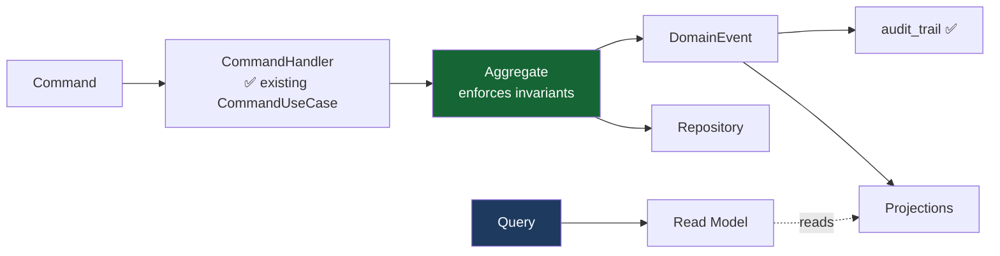

# 06 — Commands & Queries (CQRS)

| Field | Value |
|---|---|
| Status | DESIGN ONLY |
| Existing pattern | ✅ `CommandUseCase` / `UseCase` in `notarist-core`; `application/command`, `application/query`, `application/handler/{command,query}` already used by every module. **Reuse it — do not invent a new one.** |

---

## 0. The separation rule

| | Commands | Queries |
|---|---|---|
| Intent | change state | read state |
| Returns | an **id** or `void` — never a projection | data |
| Transaction | write, one aggregate | none (read-only) |
| Model | the domain aggregate | **read models / projections** — free to join across aggregates |
| Naming | imperative (`CreateCase`) | interrogative (`GetCase`) |
| Failure | may be **rejected by an invariant** | may return empty |

**Critical:** queries **bypass the aggregates entirely.** `GetCaseDashboard` joins case + approval +
reminder + document tables in one SQL statement. Loading aggregates to build a dashboard would be
absurd — and it is *precisely* what CQRS exists to avoid.

Commands are named for **business intent**, never as a field mutation. There is no
`UpdateCaseState(state)` command anywhere in this design: such a command would push state-machine
enforcement out of the aggregate and into request validation, where it will eventually be bypassed.
`SubmitVerification` and `ApproveQC` are different acts with different authority — flattening them
into one `PATCH` destroys that distinction.

---

## 1. Commands

### 1.1 Case Management

| Command | Payload | Emits | Rejects when |
|---|---|---|---|
| `CreateCase` | `caseType, title, clientPersonId, assignedNotarisId?` | `CaseCreated` | — |
| `AssignNotary` | `caseId, notarisId` | `CaseTransitioned`(meta) | case terminal |
| `AddParty` | `caseId, personId, partyRole` | — | case terminal |
| `RegisterCollateral` | `caseId, collateralId` | — | case terminal |
| `RegisterDeadline` | `caseId, deadlineType, dueAt` | `ReminderScheduled` | past date |
| `CreateBundle` | `caseId, bundleType, expectedDocumentCount` | `BundleCreated` | case terminal |
| `UploadDocument` | `caseId, bundleId, file metadata, checksum, documentType, classification` | `DocumentUploaded` ✅ | bundle `LOCKED` |
| `AttachExistingDocument` | `caseId, bundleId, documentId, roleInBundle` | `DocumentAttachedToBundle` | bundle `LOCKED` |
| `DetachDocument` | `caseId, bundleId, documentId` | — | bundle `LOCKED` |
| `MarkBundleComplete` | `caseId, bundleId` | — | fewer docs than expected |
| `LockBundle` | `caseId, bundleId` | `BundleLocked` | bundle not `COMPLETE` |
| `RaiseException` | `caseId, exceptionType, severity, note` | `ExceptionRaised` | — |
| `EscalateException` | `caseId, exceptionId, toRole, reason` | `ExceptionEscalated` | already resolved |
| `ResolveException` | `caseId, exceptionId, resolution` | — | — |
| `DeliverBundle` | `caseId, bundleId, recipient, channel` | `BundleDelivered` | case not `FINALIZED` |
| `AcknowledgeDelivery` | `caseId, bundleId, acknowledgedBy` | — | not `DISPATCHED` |
| `ArchiveCase` | `caseId` | `CaseArchived` | case not `DELIVERED` |
| `CancelCase` | `caseId, reason` | `CaseTransitioned(CANCEL)` | **reason blank**; case past `WAITING_QC` |

### 1.2 Document Intelligence / Verification

| Command | Payload | Emits | Rejects when |
|---|---|---|---|
| `ConfirmUpload` ✅ | `jobId, checksumSha256` | pipeline start | checksum mismatch |
| `ConfirmField` | `verificationId, fieldName` | — | field OCR `REJECTED` |
| `CorrectField` | `verificationId, fieldName, correctedValue, note` | — | field OCR `REJECTED` |
| `SubmitVerification` | `verificationId` | `VerificationCompleted(VERIFIED)` | any required field unverified |
| `RejectDocument` | `verificationId, reason` | `VerificationCompleted(REJECTED)` | — |
| `RequestRescan` | `documentId, reason` | `ExceptionRaised` | — |
| `ArchiveDocument` | `documentId, retentionPolicy` | `DocumentArchived` | — |

> `ConfirmField` on a `REJECTED`-confidence field is **rejected by the domain**. A human may not
> "confirm" text the machine could not read — that is manufacturing evidence, not verification.

### 1.3 Document Generation

| Command | Payload | Emits | Rejects when |
|---|---|---|---|
| `GenerateDraft` | `caseId, templateId, templateVersion` | `DraftGenerated` | **any bound fact unverified** |
| `RegenerateDraft` | `caseId, draftId, reason` | `DraftGenerated`(new version) | — |
| `CreateTemplate` | `jenisAkta, title` | — | not `NOTARIS` |
| `PublishTemplate` | `templateId, version` | `TemplatePublished` | unbindable slot; not `NOTARIS` |
| `RetireTemplate` | `templateId` | — | not `NOTARIS` |
| `CreateClauseVersion` | `clauseId, text, supersedes` | `ClauseVersioned` | not `NOTARIS` |

### 1.4 Quality Control

| Command | Payload | Emits | Rejects when |
|---|---|---|---|
| `StartQC` | `caseId, draftId` | `QCStarted` | no draft |
| `CompleteQC` *(system)* | `qcChecklistId` | `QCCompleted` | — |
| `RerunQC` | `caseId, draftId` | `QCStarted` (**new** checklist) | — |
| `OverrideQCWarning` | `qcChecklistId, itemCode, justification` | — | item is `BLOCKING`; **justification blank** |
| `PublishQcRuleSet` | `rules[], version` | `QCRuleSetPublished` | not `NOTARIS` |

> **A `BLOCKING` QC failure can never be overridden.** Not by ADMIN, not by the notary. If a rule is
> wrong, the *ruleset* is corrected and QC re-run — leaving an auditable trail. An override switch on
> blocking failures would, in practice, become the path of least resistance under deadline pressure,
> and the QC gate would cease to exist.

### 1.5 Approval

| Command | Payload | Emits | Rejects when |
|---|---|---|---|
| `RequestApproval` *(system)* | `caseId, approvalType, requiredRole` | `ApprovalRequested` | — |
| `ApproveQC` | `approvalId` | `ApprovalGranted` | wrong role; **decider == drafter** (four-eyes) |
| `ApproveBundle` / `ApproveNotarySignature` | `approvalId` | `ApprovalGranted` | **role ≠ NOTARIS** |
| `RejectApproval` | `approvalId, reason` | `ApprovalRejected` | **reason blank** |

### 1.6 Reminder / Notification

| Command | Payload | Emits |
|---|---|---|
| `ScheduleReminder` | `caseId, type, firesOnState, dueAt, targetRole` | `ReminderScheduled` |
| `SnoozeReminder` | `reminderId, until` | — |
| `CancelReminder` | `reminderId, reason` | `ReminderCancelled` |
| `MarkNotificationRead` | `notificationId` | — |
| `MarkAllNotificationsRead` | `recipientId` | — |

### 1.7 Administration

| Command | Payload |
|---|---|
| `CreatePerson` / `UpdatePerson` / `MergePerson` | person master data |
| `RegisterCollateralAsset` | certificate no., type, location, value |
| `CreateBankPartner` | organization |
| `ProvisionUser` / `AssignRole` / `DeactivateUser` | ✅ Identity (exists) |

---

## 2. Queries

Queries hit **read models**, not aggregates. Several are deliberately denormalized joins.

### 2.1 Case

| Query | Params | Returns |
|---|---|---|
| `GetCase` | `caseId` | case header + parties + deadlines |
| `GetCaseDetail` | `caseId` | + bundles + document progress + current gate |
| `SearchCases` | `state?, type?, notarisId?, clientId?, dateRange?, text?` | paged summaries |
| `GetTimeline` | `caseId` | **projection over `audit_trail`** — not a table |
| `GetWorkflowHistory` | `caseId` | domain transitions (incl. rollback reasons) |
| `GetBundle` | `bundleId` | documents + per-document ingestion status |
| `GetCaseExceptions` | `caseId?, status?` | open exception queue |

### 2.2 Dashboard & work queues — *the screens people actually live in*

| Query | Params | Returns |
|---|---|---|
| `GetDashboardSummary` | `tenantId, role` | counts by state, overdue, awaiting-me, throughput |
| `GetMyWorkQueue` | `userId, role` | everything awaiting **this person**, across all cases |
| `GetUpcomingDeadlines` | `horizonDays` | deadlines sorted by urgency |
| `GetApprovalStatus` | `caseId` | approvals + decisions |
| `GetPendingApprovalsForMe` | `role, tenantId` | ⚡ **the hot query** — cross-case, role-filtered |
| `GetReminderList` | `userId, status?` | scheduled/sent reminders |
| `GetQCStatus` | `caseId` | checklist, failed items, ruleset version |

> `GetDashboardSummary` and `GetMyWorkQueue` are **denormalized cross-aggregate joins**. They must
> **never** be built by loading aggregates in a loop. This is the entire reason the query side is
> separated from the write side.

### 2.3 Document & knowledge

| Query | Params | Returns | Route |
|---|---|---|---|
| `GetDocument` ✅ | `documentId` | metadata | SQL |
| `ListDocuments` ✅ | `type?, status?, caseId?`, page | paged | SQL |
| `GetVerification` | `verificationId` | fields + confidence + spans | SQL |
| `GetDraft` | `draftId` | content + version + bindings | SQL |
| `SearchDocument` ✅ | text, filters | ranked results | **Hybrid** |
| `AskAssistant` ✅ | question, `caseId?` | grounded answer + citations | **Routed** ⬇ |

### 2.4 Query routing — the non-negotiable rule

| Query class | Example | Route | LLM? |
|---|---|---|---|
| Numeric / identifier | "akta nomor 123/VII/2024" | **SQL** | ❌ **never** |
| Legal / workflow status | "sudah ditandatangani?" | **SQL** | ❌ **never** |
| Aggregation / counting | "berapa akta bulan ini" | **SQL** | ❌ **never** |
| Attribute lookup | "akta fidusia Budi" | Hybrid | ❌ (list result) |
| Regulation / citation | "pasal 15 UU Jabatan Notaris" | Hybrid, citation-first | ⚠️ must cite |
| Semantic / explanatory | "apa syarat APHT?" | Vector → rerank → **RAG** | ✅ grounded |

**Ambiguous queries resolve the identifier via SQL first, then use the LLM only to explain the
verified record.** The fact always comes from the database; the prose comes from the model. Never the
reverse.

---

## 3. Read models (projections)

| Read model | Sourced from | Refresh |
|---|---|---|
| `CaseSummaryView` | case + bundle + document counts | on `CaseTransitioned` |
| `MyWorkQueueView` | approval + verification + exception | on the relevant events |
| `CaseTimelineView` | ✅ `audit_trail` | **query-time** (no store) |
| `DashboardCountsView` | case, grouped by state | on `CaseTransitioned` |
| `DeadlineView` | case deadlines + reminders | on `ReminderScheduled` |

**Start with plain SQL views.** Introduce materialized views only when a measured query is slow.
Materializing early buys a cache-invalidation problem in exchange for a performance win nobody asked
for.

---

## 4. Command → handler → aggregate

**The command side never reads a projection; the query side never touches an aggregate.** Every
rejection above comes from an **aggregate invariant**, never from handler-level validation — that is
what makes the rules impossible to bypass by adding a new caller.
