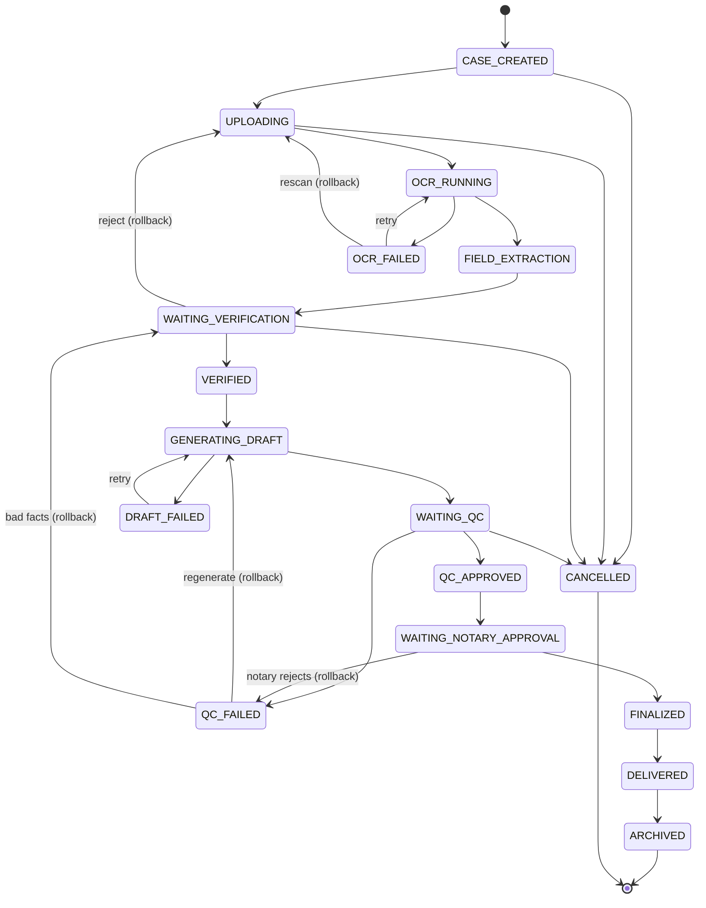
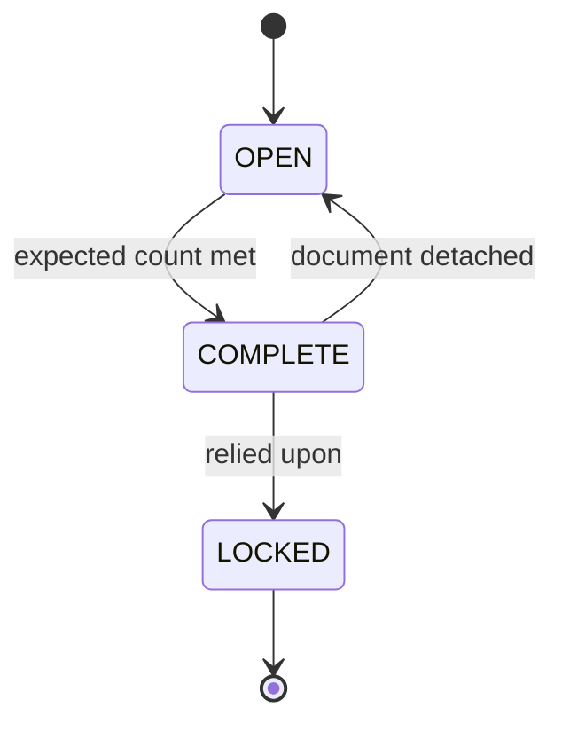
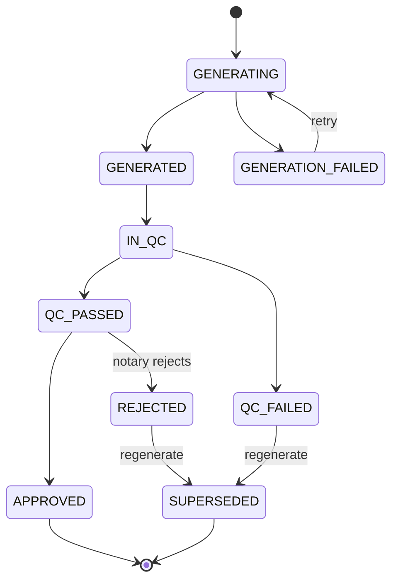
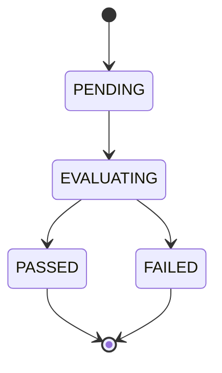
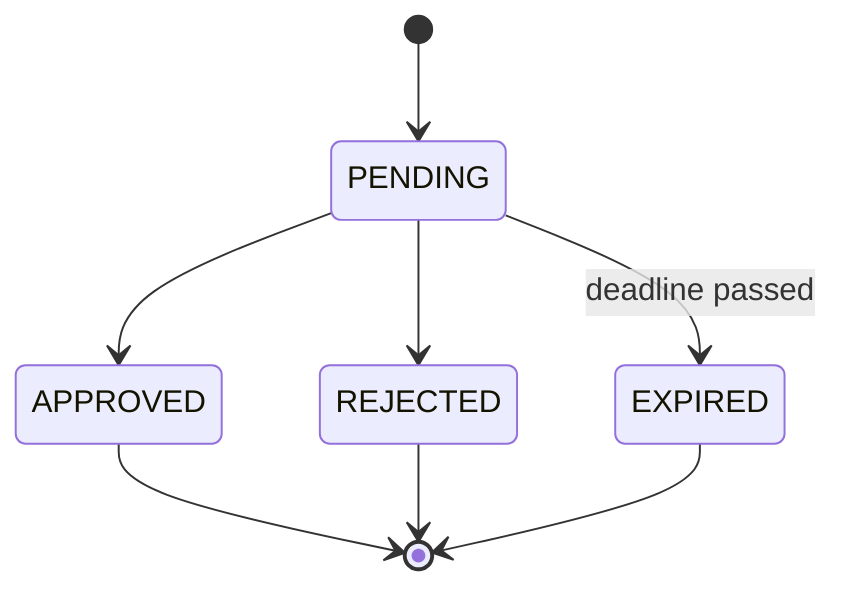
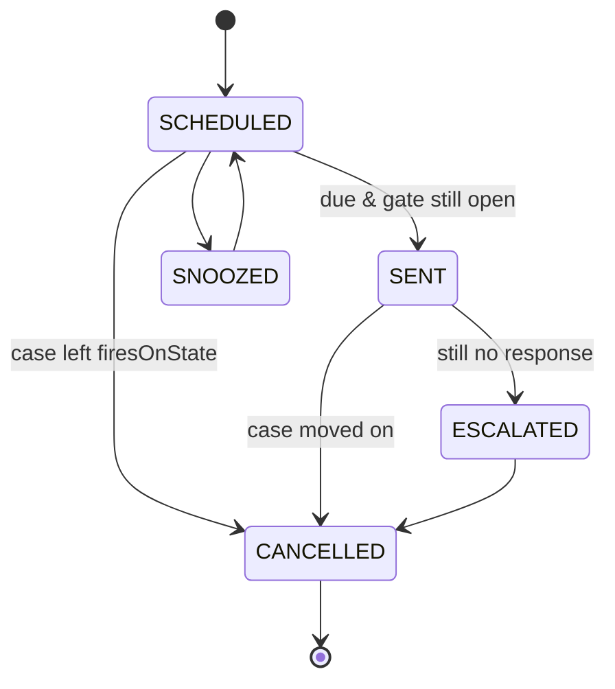
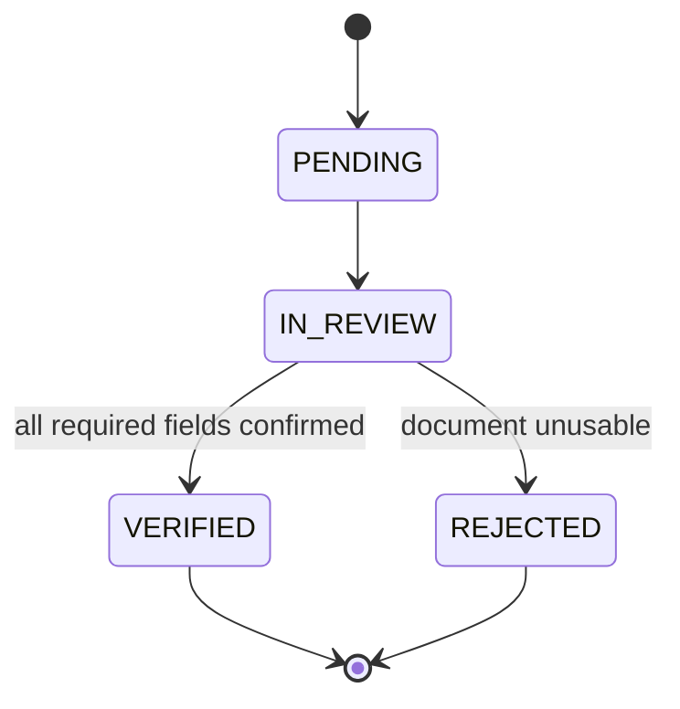

# 07 — State Machines

| Field | Value |
|---|---|
| Status | DESIGN ONLY |
| Existing machines (⛔ **do not modify**) | `DocumentStatus` (14), `PipelineStatus` (12), legacy `PipelineStage` |
| New machines | `CaseState`, `BundleStatus`, `DraftStatus`, `QcResult`, `ApprovalDecision`, `ReminderStatus`, `VerificationStatus` |

---

## 0. The altitude rule

```
CASE        ← business / human workflow      (NEW)
 └─ BUNDLE  ← composition                    (NEW)
     └─ DOCUMENT ← machine pipeline          (EXISTS — UNCHANGED)
```

`CASE.state = OCR_RUNNING` is a **derived summary**: "≥1 document in this case is not yet terminal in
its pipeline." The Case **observes** the pipeline; it never drives it. The pipeline never writes
`CaseState`; the Case never writes `DocumentStatus`.

Four status vocabularies now exist. This is the **last** one. They are kept apart deliberately —
merging them produces a ~26-state monolith that no one can reason about and that would force a rewrite
of the five existing ingest workers.

---

## 1. Case

### 1.1 States (16)



### 1.2 Transition table

| From | → To | Kind | Trigger | Actor |
|---|---|---|---|---|
| `CASE_CREATED` | `UPLOADING` | FORWARD | first bundle opened | Staff |
| `CASE_CREATED` | `CANCELLED` | CANCEL | abandoned | Staff/Admin |
| `UPLOADING` | `OCR_RUNNING` | FORWARD | bundle marked complete | Staff |
| `UPLOADING` | `CANCELLED` | CANCEL | | Staff/Admin |
| `OCR_RUNNING` | `FIELD_EXTRACTION` | FORWARD | **all** docs terminal & none `DLQ` | SYSTEM |
| `OCR_RUNNING` | `OCR_FAILED` | FORWARD | any doc `DLQ` / OCR `REJECTED` | SYSTEM |
| `OCR_FAILED` | `OCR_RUNNING` | **RETRY** | operator retries pipeline | Staff/Admin |
| `OCR_FAILED` | `UPLOADING` | **ROLLBACK** | document must be re-scanned | Staff |
| `FIELD_EXTRACTION` | `WAITING_VERIFICATION` | FORWARD | NER complete | SYSTEM |
| `WAITING_VERIFICATION` | `VERIFIED` | FORWARD | human accepts all fields | Staff/Notary |
| `WAITING_VERIFICATION` | `UPLOADING` | **ROLLBACK** | docs rejected, new ones needed | Staff/Notary |
| `WAITING_VERIFICATION` | `CANCELLED` | CANCEL | | Staff/Admin |
| `VERIFIED` | `GENERATING_DRAFT` | FORWARD | draft requested | Staff |
| `GENERATING_DRAFT` | `WAITING_QC` | FORWARD | `DraftGenerated` | SYSTEM |
| `GENERATING_DRAFT` | `DRAFT_FAILED` | FORWARD | generation error | SYSTEM |
| `DRAFT_FAILED` | `GENERATING_DRAFT` | **RETRY** | retry | Staff |
| `WAITING_QC` | `QC_APPROVED` | FORWARD | `QCCompleted(PASSED)` | SYSTEM |
| `WAITING_QC` | `QC_FAILED` | FORWARD | `QCCompleted(FAILED)` | SYSTEM |
| `WAITING_QC` | `CANCELLED` | CANCEL | | Admin |
| `QC_FAILED` | `GENERATING_DRAFT` | **ROLLBACK** | draft was wrong | Staff |
| `QC_FAILED` | `WAITING_VERIFICATION` | **ROLLBACK** | **source facts** were wrong | Staff |
| `QC_APPROVED` | `WAITING_NOTARY_APPROVAL` | FORWARD | submitted for signature | Staff |
| `WAITING_NOTARY_APPROVAL` | `FINALIZED` | FORWARD | `ApprovalGranted` | **NOTARIS only** |
| `WAITING_NOTARY_APPROVAL` | `QC_FAILED` | **ROLLBACK** | notary rejects | **NOTARIS only** |
| `FINALIZED` | `DELIVERED` | FORWARD | salinan dispatched | Staff |
| `DELIVERED` | `ARCHIVED` | FORWARD | retention | SYSTEM |

### 1.3 Classification

| Class | States |
|---|---|
| **Terminal** | `ARCHIVED`, `CANCELLED` — no outbound transitions, immutable |
| **Retry** | `OCR_FAILED`, `DRAFT_FAILED` — re-enter the *same* stage |
| **Rollback** | `QC_FAILED`→(`GENERATING_DRAFT`\|`WAITING_VERIFICATION`), `WAITING_VERIFICATION`→`UPLOADING`, `OCR_FAILED`→`UPLOADING`, `WAITING_NOTARY_APPROVAL`→`QC_FAILED` |
| **Human gate** (reminders fire here) | `WAITING_VERIFICATION`, `WAITING_QC`, `WAITING_NOTARY_APPROVAL` |
| **System (automatic)** | `OCR_RUNNING`, `FIELD_EXTRACTION`, `GENERATING_DRAFT` |

### 1.4 Invalid transitions (explicitly forbidden)

| Forbidden | Why |
|---|---|
| any → `FINALIZED` without `ApprovalGranted(NOTARY_SIGNATURE)` | **Only a notary's approval creates a deed.** The most important rule in the system. |
| `WAITING_QC` → `WAITING_NOTARY_APPROVAL` | QC cannot be skipped. The notary must never be the first to see an error. |
| `QC_FAILED` → `QC_APPROVED` | A failed QC is never "approved" — the draft is regenerated and **re-evaluated**. |
| `ARCHIVED` / `CANCELLED` → anything | Terminal. |
| `FINALIZED` → `CANCELLED` | **A signed deed cannot be cancelled.** It can only be corrected by a *new* deed (an *akta perbaikan*). Erasing a signed instrument is legally impossible. |
| `DELIVERED` → `UPLOADING` | No rollback after delivery; issue a new case. |
| any → `CASE_CREATED` | Genesis state; unreachable by transition. |
| skipping `WAITING_VERIFICATION` | Facts must be human-verified before drafting. **The liability boundary.** |

> `CANCELLED` is **not** in the brief; it is added deliberately. Without it, an abandoned case is stuck
> in a waiting state forever and reminders nag on it indefinitely. Note it is unreachable **after**
> `QC_APPROVED` — once the notary is involved, the case must be explicitly rejected, not silently
> dropped.

### 1.5 Rollback rules

1. **Reason is mandatory.** A rollback without a recorded reason is rejected by the aggregate.
2. **Nothing is destroyed.** The rejected draft/verification is retained and versioned. A notary must
   be able to show what changed and why.
3. **Rollback is audited** with `transitionKind = ROLLBACK`, actor and reason.
4. `QC_FAILED` **must not** auto-choose its rollback target. Whether the *draft* was wrong or the
   *facts* were wrong requires human judgement — and getting this distinction wrong is the most likely
   design error in the whole workflow.

---

## 2. Bundle



| From | → To | Rule |
|---|---|---|
| `OPEN` | `COMPLETE` | documents ≥ `expectedDocumentCount` |
| `COMPLETE` | `OPEN` | a document was detached (only while unlocked) |
| `COMPLETE` | `LOCKED` | at `WAITING_NOTARY_APPROVAL` |

- **Terminal:** `LOCKED`
- **Invalid:** `LOCKED → *` (**there is no unlock operation, at any privilege level**);
  `OPEN → LOCKED` (must be complete first)
- **Why irreversible:** the notary signed on the basis of *these exact documents*. Swapping one
  afterwards silently invalidates the evidentiary chain. A correction requires a **new bundle version**,
  recorded as such.

---

## 3. Document ✅ EXISTS — ⛔ UNCHANGED

`UPLOADED → OCR_QUEUE → OCR_PROCESSING → NER_QUEUE → … → INDEXING_PROCESSING → INDEXED`
with `* → FAILED`, `FAILED → OCR_QUEUE` (retry) | `→ DLQ`.

- **Terminal:** `INDEXED`, `DLQ`
- **Retry:** `FAILED → OCR_QUEUE`
- ⚠️ **Known defect (pre-existing, not introduced here):** `DocumentLegal.transitionStatus()` performs
  **unguarded assignment** with a `// TODO: enforce state machine transitions`. The rules live only in
  the static `DocumentStatusMachine`, which any caller can bypass. **New aggregates must enforce
  invariants *inside* the aggregate.** Logged as debt.

---

## 4. Draft



- **Terminal:** `APPROVED`, `SUPERSEDED`
- **Retry:** `GENERATION_FAILED → GENERATING`
- **Invalid:** editing a `GENERATED` draft in place (regeneration creates a **new version**);
  `QC_FAILED → APPROVED`; any transition out of `APPROVED`
- **Rule:** a rejected draft becomes `SUPERSEDED`, never deleted. Version history is the audit trail of
  legal drafting.

---

## 5. QC



- **Terminal:** `PASSED`, `FAILED` — **immutable**
- **Retry:** none. A re-run creates a **new checklist**; it never mutates an existing verdict.
- **Invalid:** `FAILED → PASSED` (**a verdict is never edited**); overriding a `BLOCKING` item
- **Determinism:** same draft + same facts + same ruleset ⇒ same verdict. No LLM, no network, no clock.

---

## 6. Approval



- **Terminal:** all three. **A decision is never reversed** — reversing means raising a *new* approval,
  because the original decision and its reversal are **both** legally significant facts.
- **Retry:** none.
- **Invalid:** `APPROVED → REJECTED` (and vice versa); deciding without `requiredRole`; **rejecting
  without a reason**; `NOTARY_SIGNATURE` decided by anyone but `NOTARIS` — *not even ADMIN or
  PIMPINAN*, since notarial authority is statutory and personal, not an org-chart permission.

---

## 7. Reminder



- **Terminal:** `CANCELLED`
- **Invalid:** firing on a terminal case; firing when the case has left `firesOnState`
- **Auto-cancel rule:** on every `CaseTransitioned`, all reminders whose `firesOnState` ≠ the new state
  are cancelled. This is what prevents the credibility-destroying bug of reminding a notary to sign
  something they already signed.

---

## 8. Verification



- **Terminal:** `VERIFIED`, `REJECTED`
- **Invalid:** `VERIFIED` while any required field is unconfirmed; **confirming a field whose OCR
  confidence is below the `REJECTED` threshold (< 0.40)** — a human may not "confirm" text the machine
  could not read; **auto-verification by a machine, under any circumstances.**
- ✅ Reuses the existing `OcrConfidencePolicy` thresholds (`0.80` / `0.40`) — **not re-invented.**

---

## 9. Cross-machine coupling

| Document/Sub-machine event | Case reaction |
|---|---|
| all docs `INDEXED` | `OCR_RUNNING → FIELD_EXTRACTION` |
| any doc `DLQ` | `OCR_RUNNING → OCR_FAILED` |
| `Verification → VERIFIED` | `WAITING_VERIFICATION → VERIFIED` |
| `Draft → GENERATED` | `GENERATING_DRAFT → WAITING_QC` |
| `QC → PASSED` | `WAITING_QC → QC_APPROVED` |
| `QC → FAILED` | `WAITING_QC → QC_FAILED` |
| `Approval(NOTARY) → APPROVED` | `WAITING_NOTARY_APPROVAL → FINALIZED` |
| `Approval(NOTARY) → REJECTED` | `WAITING_NOTARY_APPROVAL → QC_FAILED` |

**All coupling is via domain events and is eventually consistent.** No sub-machine ever calls the Case
synchronously, and the Case never reaches into a sub-machine to change it.
