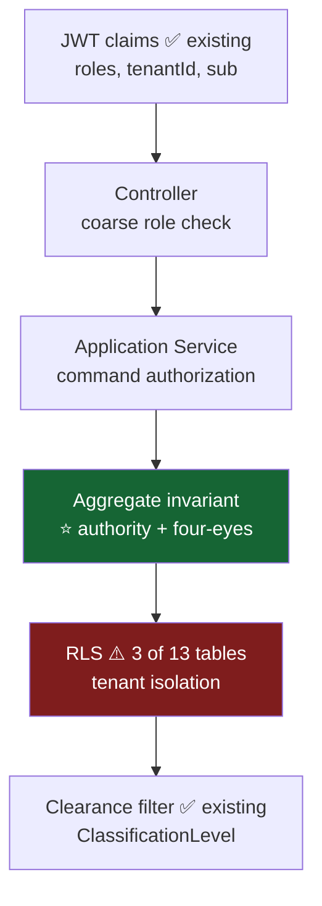

# 08 — RBAC & Permissions

| Field | Value |
|---|---|
| Status | DESIGN ONLY |
| ⚠️ Conflict | **The six roles in the brief do not match the five that exist in code.** Resolution required — see §1. |

---

## 1. ⚠️ Role conflict — a decision is needed

### What exists (`notarist-auth/domain/model/Role.java`)

Roles are **already implemented**, already in JWT claims, and already bound to data clearance:

| Existing role | Default clearance |
|---|---|
| `STAFF` | `INTERNAL` |
| `NOTARIS` | `CONFIDENTIAL` |
| `PPAT_OFFICER` | `CONFIDENTIAL` |
| `PIMPINAN` | `STRICTLY_CONFIDENTIAL` |
| `ADMIN` | `STRICTLY_CONFIDENTIAL` |

Role is **not just a permission label** — it carries `ClassificationLevel` clearance, which already
filters document retrieval (`resolveCallerClearance()` in `DocumentController`, and the per-source
security filter in Search). **Changing this enum changes what data people can see.**

### What the brief asks for

`Admin`, `Notary`, `Senior Staff`, `Junior Staff`, `Reviewer`, `Guest`

### The mismatch

| Brief role | Maps to | Problem |
|---|---|---|
| Admin | ✅ `ADMIN` | clean |
| Notary | ✅ `NOTARIS` | clean |
| Senior Staff | ⚠️ `STAFF`? `PIMPINAN`? | **ambiguous** |
| Junior Staff | ⚠️ `STAFF` | no seniority axis exists |
| Reviewer | ❌ **absent** | needed for four-eyes QC |
| Guest | ❌ **absent** | no read-only role exists |
| — | ❗ `PPAT_OFFICER` | **exists, not in the brief. Cannot be dropped** — PPAT work (APHT/SKMHT/AJB) is a distinct statutory function. |

### Recommendation — additive, minimal

**Do not restructure the enum.** Add exactly two values and model seniority as a *separate attribute*,
not a role:

```
STAFF            (existing)   ← "Junior Staff"
NOTARIS          (existing)   ← "Notary"
PPAT_OFFICER     (existing)   ← keep; statutory
PIMPINAN         (existing)   ← "Senior Staff" / office head
ADMIN            (existing)   ← "Admin"
REVIEWER         🆕 CONFIDENTIAL      ← enables four-eyes QC
GUEST            🆕 PUBLIC            ← read-only, lowest clearance
```

**Why not a Senior/Junior split?** Seniority is an *authority level*, not a data-clearance level. A
senior staffer sees the same documents as a junior one; they are merely allowed to approve more.
Encoding seniority in the clearance-bearing `Role` enum would conflate *what you can see* with *what
you can do* — and would silently change document visibility. If seniority gating is needed, model it as
a `seniority` attribute on the user and check it in the Approval aggregate.

> **Adding `REVIEWER`/`GUEST` touches the `Role` enum, which is in the auth module.** The auth *flow*
> is untouched (no login/JWT/refresh change), but this is still a change to Identity and must be
> explicitly approved before implementation. **Blocking decision — see roadmap D5.**

---

## 2. Authority principles

1. **Notarial authority is statutory and personal.** `NOTARY_SIGNATURE` may be decided **only** by
   `NOTARIS` — not `ADMIN`, **not even `PIMPINAN`**. It cannot be escalated upward, delegated, or
   overridden. An ADMIN who can sign deeds is a fraud vector, not a convenience.
2. **Admin ≠ Notary.** `ADMIN` administers the *system*. It cannot perform *legal* acts.
3. **Four-eyes:** the QC approver must differ from the draft's author.
4. **A `BLOCKING` QC failure is not overridable — by anyone.** Fix the ruleset and re-run, leaving an
   audit trail. An override switch would become the path of least resistance under deadline pressure,
   and the gate would cease to exist.
5. **Least privilege by default.** Unlisted ⇒ **denied**. Fail closed.
6. **Tenant isolation is enforced by RLS, beneath RBAC.** RBAC says *what* you may do; RLS says *whose
   data*. Neither substitutes for the other. ⚠️ RLS currently covers only 3 of 13 tables — every new
   table must ship with it.

---

## 3. Command permissions

`X` = may execute · `—` = denied

### 3.1 Case Management

| Command | ADMIN | NOTARIS | PPAT | PIMPINAN | STAFF | REVIEWER | GUEST |
|---|---|---|---|---|---|---|---|
| `CreateCase` | X | X | X | X | X | — | — |
| `AssignNotary` | X | X | — | X | — | — | — |
| `AddParty` / `RegisterCollateral` | X | X | X | X | X | — | — |
| `CreateBundle` | X | X | X | X | X | — | — |
| `UploadDocument` | X | X | X | X | X | — | — |
| `AttachExistingDocument` | X | X | X | X | X | — | — |
| `DetachDocument` | X | X | X | X | X | — | — |
| `LockBundle` | — | X | X | X | — | — | — |
| `RaiseException` | X | X | X | X | X | X | — |
| `EscalateException` | X | X | X | X | X | X | — |
| `ResolveException` | X | X | X | X | — | — | — |
| `DeliverBundle` | X | X | X | X | X | — | — |
| `ArchiveCase` | X | X | — | X | — | — | — |
| `CancelCase` | X | X | — | X | — | — | — |

### 3.2 Verification

| Command | ADMIN | NOTARIS | PPAT | PIMPINAN | STAFF | REVIEWER | GUEST |
|---|---|---|---|---|---|---|---|
| `ConfirmField` / `CorrectField` | — | X | X | X | X | X | — |
| `SubmitVerification` | — | X | X | X | X | X | — |
| `RejectDocument` / `RequestRescan` | — | X | X | X | X | X | — |
| `ArchiveDocument` | X | X | — | X | — | — | — |

> **ADMIN cannot verify.** Verification is a *legal* act (asserting the data is true), not a systems
> act. This is deliberate and is the same principle as ADMIN not being able to sign.

### 3.3 Drafting

| Command | ADMIN | NOTARIS | PPAT | PIMPINAN | STAFF | REVIEWER | GUEST |
|---|---|---|---|---|---|---|---|
| `GenerateDraft` / `RegenerateDraft` | — | X | X | X | X | — | — |
| `CreateTemplate` / `PublishTemplate` | — | **X** | — | — | — | — | — |
| `RetireTemplate` | X | X | — | — | — | — | — |
| `CreateClauseVersion` | — | **X** | — | — | — | — | — |

**Templates and clauses are Notary-only.** Templating *is* legal drafting — it is the office's
accumulated legal craft, applied to every future deed. A bad template silently corrupts hundreds of
instruments.

### 3.4 Quality Control

| Command | ADMIN | NOTARIS | PPAT | PIMPINAN | STAFF | REVIEWER | GUEST |
|---|---|---|---|---|---|---|---|
| `StartQC` / `RerunQC` | — | X | X | X | X | X | — |
| `OverrideQCWarning` | — | X | X | X | — | X | — |
| **Override a `BLOCKING` failure** | **—** | **—** | **—** | **—** | **—** | **—** | **—** |
| `PublishQcRuleSet` | — | **X** | — | — | — | — | — |

**No role can override a blocking QC failure.** Not even the notary. See principle 4.

### 3.5 Approval

| Command | ADMIN | NOTARIS | PPAT | PIMPINAN | STAFF | REVIEWER | GUEST |
|---|---|---|---|---|---|---|---|
| `ApproveQC` | — | X | X | X | — | **X** | — |
| **`ApproveNotarySignature`** | **—** | **X** | ⚠️ see below | **—** | — | — | — |
| `RejectApproval` | — | X | X | X | — | X | — |

- **`ApproveNotarySignature` is `NOTARIS`-only.** The single most restricted operation in the system.
- ⚠️ **Open question:** may a `PPAT_OFFICER` sign PPAT deeds (APHT/SKMHT/AJB)? In Indonesian practice
  PPAT is a distinct statutory office with its own signing authority. If so, the approval's
  `requiredRole` must be derived from `CaseType` (`FIDUSIA` → NOTARIS; `APHT` → PPAT_OFFICER) rather
  than being a fixed constant. **Blocking decision — D6.**
- **`ApproveQC` is subject to four-eyes:** `decidedBy ≠ draft author`, enforced in the aggregate.

### 3.6 Administration & Identity

| Command | ADMIN | NOTARIS | PIMPINAN | others |
|---|---|---|---|---|
| `ProvisionUser` / `AssignRole` / `DeactivateUser` | X | — | — | — |
| `CreatePerson` / `MergePerson` | X | X | X | STAFF: create only |
| `RegisterCollateralAsset` | X | X | X | STAFF: X |

---

## 4. Read permissions

Read access is governed by **two independent gates**, both of which must pass:

1. **RBAC** — is this role allowed to read this *kind* of thing?
2. **Clearance** — does the role's `ClassificationLevel` meet the record's `classificationLevel`?
   ✅ *This already exists and works — reuse it. Do not build a parallel mechanism.*

| Resource | ADMIN | NOTARIS | PPAT | PIMPINAN | STAFF | REVIEWER | GUEST |
|---|---|---|---|---|---|---|---|
| Case header | X | X | X | X | X | X | — |
| Case detail / bundles | X | X | X | X | X | X | — |
| Timeline | X | X | X | X | X | X | — |
| Document content | clearance-gated | ✓ CONFIDENTIAL | ✓ CONFIDENTIAL | ✓ STRICT | ✓ INTERNAL | ✓ CONFIDENTIAL | ✓ PUBLIC only |
| Draft | X | X | X | X | X | X | — |
| QC result | X | X | X | X | X | X | — |
| Approvals | X | X | X | X | X | X | — |
| **Minuta** | — | **X** | X | — | — | — | — |
| Audit trail | X | X | — | X | — | — | — |
| Dashboard | X | X | X | X | X | X | — |
| System config | X | — | — | — | — | — | — |

- **The Minuta is the notary's protocol.** Even ADMIN cannot read it — an administrator has no legal
  business reading the original signed instrument.
- **GUEST** sees only `PUBLIC`-classified material. It exists for external counsel / client portals.
- **ADMIN can read the audit trail but cannot alter it** — it is append-only by construction.

---

## 5. Override authority

| Override | Who | Constraint |
|---|---|---|
| Retry a failed pipeline | ADMIN, STAFF+ | — |
| Rollback a case | NOTARIS, PIMPINAN, STAFF | **reason mandatory** |
| Cancel a case | ADMIN, NOTARIS, PIMPINAN | only before `QC_APPROVED` |
| Override a QC **warning** | NOTARIS, PPAT, PIMPINAN, REVIEWER | **written justification mandatory** |
| Override a QC **blocking** failure | ❌ **NOBODY** | fix the ruleset and re-run |
| Reverse an approval | ❌ **NOBODY** | raise a *new* approval |
| Unlock a bundle | ❌ **NOBODY** | create a new bundle version |
| Alter the audit trail | ❌ **NOBODY** | append-only |
| Alter the repertorium | ❌ **NOBODY** | statutory; gapless; append-only |
| Cancel a `FINALIZED` case | ❌ **NOBODY** | correct via a new deed (*akta perbaikan*) |

**Every "NOBODY" above is deliberate.** They are the properties that make the system trustworthy to a
regulator. Each one will, at some point, be inconvenient — and each request to add an override switch
should be treated as a request to delete the control entirely, because in practice that is what it
becomes.

---

## 6. Enforcement layers



**Authority is enforced in the aggregate (layer D), not only at the controller.** A controller check is
bypassed the moment a second caller (an event listener, a batch job, a new endpoint) reaches the same
use case. `Approval.approve(actor)` re-checks the role itself — so the rule holds no matter who calls it.

⚠️ **Layer E is the current weak point:** RLS is enabled on only `notarist_user`, `dokumen_legal` and
`ingestion_job`. Every new table in this program must enable RLS **in the same migration that creates
it**. Retrofitting tenant isolation is how cross-tenant leaks of confidential legal instruments happen.

---

## 7. Blocking decisions

| # | Question | Why it blocks |
|---|---|---|
| **D5** | Add `REVIEWER` and `GUEST` to the `Role` enum? | Touches Identity + JWT + clearance model. Four-eyes QC cannot be enforced without `REVIEWER`. |
| **D6** | May `PPAT_OFFICER` sign PPAT deeds? | Determines whether `Approval.requiredRole` is a constant or derived from `CaseType`. Changes the Approval aggregate. |
| **D7** | Is seniority a role or an attribute? | Recommended: an **attribute**. Confirm before the enum is touched. |
