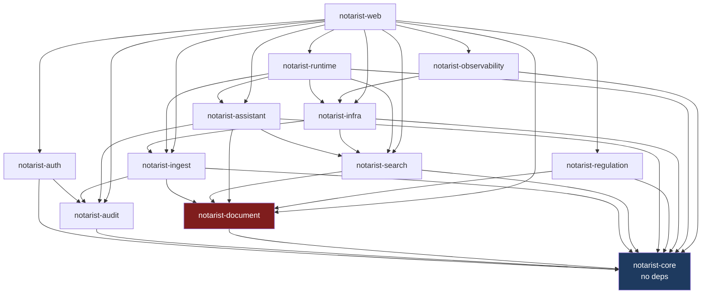
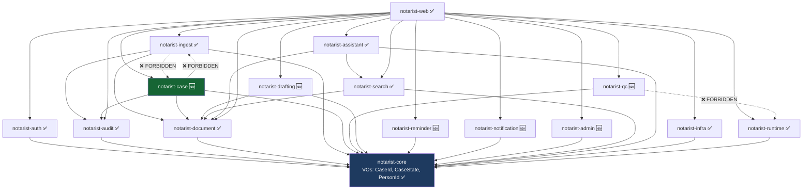
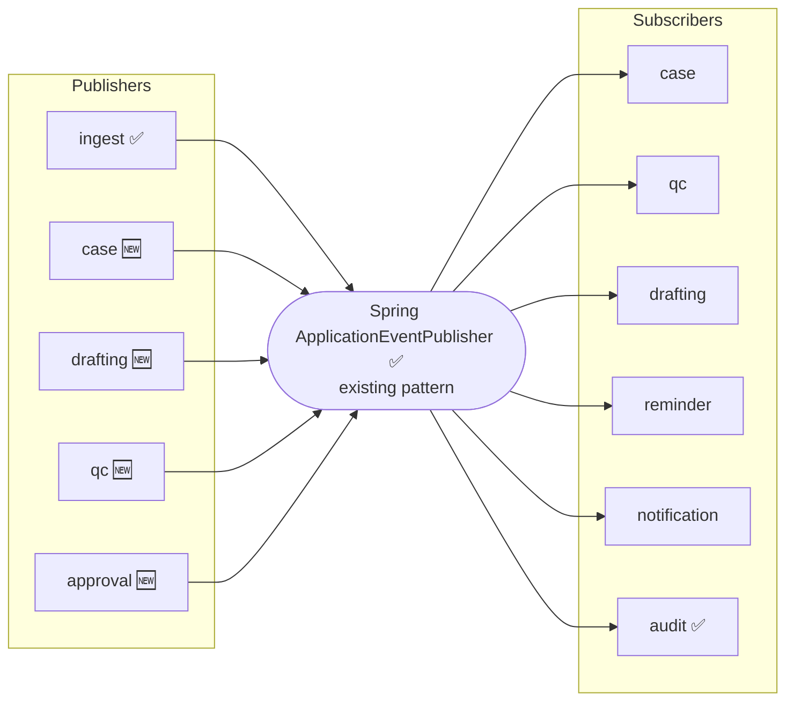

# 09 — Module Dependency Map

| Field | Value |
|---|---|
| Status | DESIGN ONLY |
| Baseline | Extracted from `backend/*/build.gradle.kts` (`project(":…")`), not from documentation |

---

## 1. Current dependency graph (as built today)

**`notarist-document` is a hub** — four modules depend on it. This is why "Document is the root
aggregate" is *structural*, not incidental: it is compiled into the build graph. It is also why the
Case model must **wrap** Document rather than replace it. Replacing it would ripple through
`ingest`, `search`, `assistant` and `regulation` simultaneously.

---

## 2. Target dependency graph

New modules depend on **`core` + at most one existing module**. None depends on another new module.

---

## 3. Forbidden dependencies

| # | Forbidden edge | Why | Use instead |
|---|---|---|---|
| **F1** | `notarist-ingest → notarist-case` | The machine pipeline must never know what a Case is. It would couple worker throughput to business workflow and make the pipeline untestable without cases. | `DocumentIngestionCompleted` event, with `caseId` **echoed** from the existing `ingestion_queue.payload` JSONB |
| **F2** | `notarist-case → notarist-ingest` | The Case would block on worker mechanics; also closes a cycle with F1. | `DocumentStatusPort` (read-only, via `notarist-document`) |
| **F3** | `notarist-qc → notarist-runtime` | ⭐ **QC must be deterministic.** Any path to an LLM destroys the guarantee that the same draft + facts + ruleset yields the same verdict. | nothing — QC has **zero** external dependencies, by design |
| **F4** | `notarist-drafting → notarist-ingest` | Drafting consumes **verified** facts, never raw OCR output. | `VerifiedFactPort` |
| **F5** | any → a concrete AI provider (Ollama, Paddle…) | Bypasses the runtime's timeout, cancellation, queue-isolation and degradation guarantees. | ✅ `RegistryLlmPort`, `EmbeddingProvider`, `OcrProvider` |
| **F6** | any → GCS / Qdrant directly | Bypasses the storage abstraction. | ✅ `DocumentStoragePort`, `VectorIndexPort` |
| **F7** | `notarist-core → anything` | Core must stay dependency-free; it is shared by every module. | — |
| **F8** | application service → application service | Hidden coupling; contexts silently fuse into a monolith. | domain events |
| **F9** | `notarist-audit → any business module` | Audit is generic and must remain so; a dependency would invert the flow. | audit **listens**; it never calls |
| **F10** | any new module → `notarist-assistant` | Assistant is a top-level consumer, not a building block. | — |

> **F1/F2 together are the most important constraint in this design.** Every request to "just inject
> the CaseService into the OCR worker" must be refused. It is the shortest path to re-fusing the two
> lifecycles the project direction explicitly forbids merging.

---

## 4. Allowed dependencies

| From | May depend on | Purpose |
|---|---|---|
| any | `notarist-core` | VOs, `ApiResponse`, `DomainEvent`, `VpdContextHolder` |
| `notarist-case` | `core`, `document`, `audit` | read document status; publish audit |
| `notarist-qc` | `core` **only** | determinism |
| `notarist-drafting` | `core`, `document` | persist rendered deed as a `DocumentLegal` |
| `notarist-reminder` | `core` | + `NotificationPort` (interface only) |
| `notarist-notification` | `core` | channel adapters |
| `notarist-admin` | `core` | master data |
| `notarist-search` | `core`, `document` | ✅ unchanged |
| `notarist-web` | everything | composition root |

**Rule:** a new module may depend on **`core` + at most one existing module**. If it needs two, that is
a signal the boundary is wrong.

---

## 5. Port ownership — who defines the interface

Hexagonal rule: **the consumer defines the port; the provider implements it.** This keeps the arrow of
dependency pointing inward, toward the domain.

| Port | Defined in (consumer) | Implemented in (provider) |
|---|---|---|
| `DocumentStatusPort` | `notarist-case` | `notarist-document` |
| `VerifiedFactPort` | `notarist-drafting`, `notarist-qc` | `notarist-document` |
| `DraftContentPort` | `notarist-qc` | `notarist-drafting` |
| `CaseStatePort` | `notarist-reminder` | `notarist-case` |
| `NotificationPort` | `notarist-reminder` | `notarist-notification` |
| `RoleAuthorityPort` | `notarist-case` | `notarist-auth` |
| `CaseFactPort` | `notarist-search` | `notarist-case` |
| ✅ `LlmPort`, `EmbeddingPort`, `OcrServicePort`, `VectorIndexPort`, `DocumentStoragePort` | existing consumers | ✅ `runtime` / `infra` |

⚠️ `CaseFactPort` (Search → Case) is the one edge that could become a cycle if Case ever needed Search.
**It must not.** Case has no reason to search; if that requirement ever appears, revisit the boundary
rather than adding the edge.

---

## 6. The event bus — the real integration substrate

The bus is what makes the forbidden edges (§3) unnecessary. It **already exists** —
`IngestionEventPublisher` → `AuditEventListener` is the established pattern. **No message broker is
introduced.**

> **Scaling note:** an in-process Spring event bus is correct for a single deployable and is what the
> codebase already uses. If a context is later extracted to its own service (§7), its events must move
> to a durable broker with an outbox — at which point the *event contracts* defined in
> `04-domain-events.md` become the wire contract, unchanged. Designing them as durable-ready facts now
> is what makes that extraction cheap later.

---

## 7. Future extraction candidates

If the monolith is ever split, extract in this order — easiest and most valuable first.

| Rank | Module | Why it extracts cleanly | Blocker |
|---|---|---|---|
| 1 | `notarist-notification` | Zero domain coupling; pure fan-out; different scaling profile (bursty) | none |
| 2 | `notarist-qc` | **Zero external dependencies by design**; pure function; independently auditable | needs `VerifiedFactPort` over the wire |
| 3 | `notarist-runtime` | Already isolated behind an SPI; GPU-bound — a completely different scaling profile from the web tier | heaviest to operate |
| 4 | `notarist-reminder` | Scheduler-shaped; naturally a background service | needs durable events |
| 5 | `notarist-search` + `assistant` | Read-only; scales independently of writes | shares `document` |
| ❌ | `notarist-case` | **Do not extract.** It is the transactional core; splitting it fragments the aggregate boundary and pushes the workflow into distributed transactions. | — |
| ❌ | `notarist-document`/`ingest` | Hub with four dependents; extraction would ripple everywhere | — |

**Do not extract anything yet.** The modular monolith with strict boundaries is the right architecture
for this system's current scale. The boundaries above are what make extraction *possible later* — that
is their value today. Extracting early buys distributed-systems problems in exchange for an
organizational benefit that a team this size does not yet need.

---

## 8. Dependency rules to enforce mechanically

These should be **compile-time enforced** (ArchUnit or Gradle module boundaries), not left to review:

1. `notarist-core` has zero `project()` dependencies.
2. No path exists between `notarist-ingest` and `notarist-case`, in either direction.
3. `notarist-qc` declares **no** dependency other than `notarist-core`.
4. No module outside `runtime`/`infra` imports `ollama`, `qdrant`, `gcs` or `paddle` packages.
5. No `application.service` class references another `application.service` class.
6. Domain packages import nothing from `infrastructure`.

A rule that is only written down is a rule that will be broken under deadline pressure. Rule 2 and
rule 3 in particular protect the two properties this whole design rests on — **lifecycle separation**
and **QC determinism**.
