# 10 — Implementation Roadmap

| Field | Value |
|---|---|
| Status | DESIGN ONLY — **no code, no migrations, no commits** |
| Principle | Strangler-fig. Additive-only. **Every sprint ships green.** |
| Compatibility | The shipped React Native app (Claude 2) must never break. |

---

## 0. Blocking decisions — needed before code starts

These are **product/legal decisions I must not make unilaterally.** Sprints 2+ are blocked on them.

| # | Decision | Blocks | Recommendation |
|---|---|---|---|
| **D1** | May the same physical file belong to multiple cases? | Sprint 3 | **Yes.** Keep `uq_dokumen_checksum_tenant`; add a `bundle_document` M:N link. One blob, OCR'd once, linked N times. ⚠️ Requires `DuplicateDetector` to change from *"reject duplicate"* → *"link existing document"* — **the single riskiest change in the whole program.** |
| **D2** | Is case-less document browsing permanently supported? | Sprint 3 | **Yes, permanently.** `case_id` stays nullable **forever**. Notaries browse aktas directly, and thousands of existing rows have no case. |
| **D3** | Four-eyes on QC sign-off? | Sprint 6 | **Yes.** `qcApprover ≠ draftAuthor`. Standard for legal instruments. Requires the `REVIEWER` role (D5). |
| **D4** | May the LLM draft prose? | Sprint 5 | **Yes for prose; never for facts.** Every NIK/name/nomor/date/amount is injected from verified extraction. QC then validates fact-by-fact. |
| **D5** | Add `REVIEWER` + `GUEST` to the `Role` enum? | Sprint 6 | **Yes, additively.** Touches Identity (JWT claims + clearance). Four-eyes is unenforceable without `REVIEWER`. |
| **D6** | May `PPAT_OFFICER` sign PPAT deeds (APHT/SKMHT/AJB)? | Sprint 6 | **Likely yes** (PPAT is a distinct statutory office). If so, `Approval.requiredRole` must derive from `CaseType`, not be a constant. **Needs a lawyer's answer, not an engineer's.** |
| **D7** | Is seniority a role or an attribute? | Sprint 6 | **An attribute.** Do not encode seniority in the clearance-bearing `Role` enum. |

> **Sprint 1 and Sprint 2 are unblocked and can start immediately.**

---

## 1. Sprint sequence

```mermaid
gantt
    title Implementation order (dependencies, not calendar time)
    dateFormat X
    axisFormat %s
    section Unblocked
    S1 Search routing (fixes a live bug)   :s1, 0, 2
    S2 Foundations (VOs, module, audit)    :s2, 0, 1
    section Core
    S3 Case + Bundle skeleton              :s3, after s2, 2
    S4 Case-aware upload  (needs D1)       :s4, after s3, 2
    S5 Workflow → VERIFIED                 :s5, after s4, 2
    section Business
    S6 Drafting + Templates (needs D4)     :s6, after s5, 3
    S7 QC (needs D3)                       :s7, after s6, 2
    S8 Approval + Repertorium (D5,D6)      :s8, after s7, 2
    S9 Delivery + Reminders + Notification :s9, after s8, 2
    S10 Admin + Dashboard                  :s10, after s9, 2
```

---

## Sprint 1 — Search Answer Routing ⭐ **start here**

- **Objective:** Stop numeric, status and aggregation queries from being answered by an LLM. Implement
  `AnswerRouter` + `FactualQueryGuard`; route factual queries to SQL.
- **Why first:** This fixes a **correctness and liability bug that exists in production today.**
  `SearchIntent` is classified and then **never used** — `RetrievalPipeline` (whose Javadoc promises
  intent-based strategy selection) has **zero implementations**. Right now, *"is akta 42 already
  signed?"* is answered by a language model reading text chunks. In a notary office that is not a
  quality issue; it is a liability.
- **Dependencies:** **none.** Fully independent of the Case model.
- **Breaking risk:** **MEDIUM.** `POST /assistant/ask` is called by the shipped app. The *envelope*
  (`answerText`/`citations`/`confidence`) must not change; the *answer* becomes correct.
- **Migration:** none.
- **Rollback:** feature-flag the router off → falls back to today's single hybrid pipeline.
- **Complexity:** **M** (routing rules + guard + tests).
- **Definition of done:** a status/numeric query provably never reaches `LlmPort` — asserted by a test
  that fails if it does.

## Sprint 2 — Foundations (dark)

- **Objective:** `CaseId`/`CaseState`/`CaseNumber`/`BundleId` VOs in `notarist-core`; empty
  `notarist-case` module wired into `settings.gradle.kts` + `notarist-web`; widen audit vocabulary
  (`subject_type += CASE|BUNDLE|APPROVAL`, `event_category += CASE`).
- **Dependencies:** none.
- **Breaking risk:** **NONE.** Nothing calls any of it.
- **Migration:** **none — zero DDL.** `subject_type`/`event_category` are already `VARCHAR`.
- **Rollback:** delete the module.
- **Complexity:** **S**.

## Sprint 3 — Case + Bundle skeleton *(needs D1, D2)*

- **Objective:** `Case` aggregate + `CaseStateMachine` (**invariants inside the aggregate** — do not
  repeat the `DocumentLegal` static-helper mistake); `Bundle`; `bundle_document` M:N link; `POST/GET
  /cases`. Feature-flagged off.
- **Dependencies:** Sprint 2.
- **Breaking risk:** **LOW** (new tables only).
- **Migration:** **V10** — `notaris_case`, `bundle`, `bundle_document`, `case_workflow` **+ RLS
  policies in the same migration** (RLS currently covers only 3 of 13 tables — never retrofit it).
- **Rollback:** drop the new tables; no existing table touched.
- **Complexity:** **L**.
- **Highest-value tests in the program:** exhaustive state-machine coverage — every allowed transition,
  every forbidden one, terminal states, rollback edges, role gates.

## Sprint 4 — Case-aware upload ⚠️ **riskiest sprint** *(needs D1)*

- **Objective:** `POST /cases/{id}/bundles/{id}/upload` delegating to the **same**
  `UploadOrchestrationService` as the existing `POST /ingest` (two doors, one service — no duplicated
  logic, no proxy, no version fork). `notarist-ingest` echoes `caseId` from the existing job payload
  and emits `DocumentIngestionCompleted`.
- **Dependencies:** Sprint 3.
- **Breaking risk:** **HIGH.** This is the only sprint that touches `notarist-ingest` — the most
  intricate code in the backend (DLQ, retry, generation guards). And **D1 changes `DuplicateDetector`
  from rejecting duplicates to linking them.**
- **Migration:** **V11** — additive **nullable** columns on `dokumen_legal`, `ingestion_job`,
  `chunk_index`. Zero backfill.
- **Rollback:** disable the case-upload route; the nullable columns sit unused and harmless.
- **Complexity:** **L**.
- **Mandatory gate:** the shipped app's existing upload flow (`/ingest` → signed URL → `/confirm` →
  `/status`) must be **driven end-to-end and observed working** before this sprint is called done.
  Compiling is not evidence.

## Sprint 5 — Workflow through VERIFIED

- **Objective:** `CASE_CREATED → … → WAITING_VERIFICATION → VERIFIED`; `Verification` aggregate
  (**reusing the existing `OcrConfidencePolicy` 0.80/0.40 thresholds — not re-inventing them**);
  timeline endpoint as an `audit_trail` **projection** (no new table).
- **Dependencies:** Sprint 4.
- **Breaking risk:** **LOW.**
- **Migration:** **V12** — `verification`, `extracted_field` + RLS.
- **Rollback:** feature-flag off.
- **Complexity:** **L**.

## Sprint 6 — Drafting + Templates *(needs D4)*

- **Objective:** `Template` (versioned, immutable when published), `LegalClause`, `Draft`; fact
  binding; rendering via the **existing `RegistryLlmPort`** (⛔ **do not create a second LLM
  abstraction** — it would fork the runtime's timeout/cancellation/degradation guarantees).
- **Dependencies:** Sprint 5.
- **Breaking risk:** **LOW** (new module).
- **Migration:** **V13** — `template`, `clause`, `draft` + RLS.
- **Rollback:** feature-flag off.
- **Complexity:** **XL** — the largest sprint. Templating is the office's core craft.
- **Invariant to enforce at the factory:** a Draft **cannot be constructed** from unverified facts.

## Sprint 7 — Quality Control *(needs D3)*

- **Objective:** `QcRuleSet` (versioned), `QcChecklist`, `QcItem`; deterministic evaluation;
  `BLOCKING` vs `WARNING`.
- **Dependencies:** Sprint 6.
- **Breaking risk:** **LOW.**
- **Migration:** **V14** — `qc_ruleset`, `qc_checklist`, `qc_item` + RLS.
- **Rollback:** feature-flag off.
- **Complexity:** **M**.
- **Architectural rule, mechanically enforced:** `notarist-qc` declares **no dependency except
  `notarist-core`**. No AI, no network, no clock. Same draft + facts + ruleset ⇒ same verdict, always.

## Sprint 8 — Approval + Repertorium *(needs D5, D6)*

- **Objective:** `Approval` aggregate with role authority + four-eyes; `Repertorium` with **gapless,
  serialized** number allocation; `FINALIZED`.
- **Dependencies:** Sprint 7.
- **Breaking risk:** **MEDIUM** — touches the `Role` enum (Identity), though **not the auth flow**.
- **Migration:** **V15** — `approval`, `repertorium`, `repertorium_entry` + RLS.
- **Rollback:** feature-flag off. ⚠️ **Allocated repertorium numbers can never be rolled back or
  reused** — a gap is a regulatory finding.
- **Complexity:** **L**.
- **⭐ The subtlest correctness requirement in the entire domain:** repertorium allocation must be
  **serialized**, **idempotent per case**, and **allocated *before* the `FINALIZED` transition** (two
  aggregates, two transactions — allocate first, then transition; the reverse can strand a finalized
  case with no number). A Postgres `SEQUENCE` is **not** sufficient: it leaves gaps on rollback, which
  is precisely what the law forbids. This needs dedicated design attention and its own tests.

## Sprint 9 — Delivery, Reminders, Notification

- **Objective:** `DELIVERED → ARCHIVED`; `Reminder` (mirroring the **existing**
  `IngestionQueueScheduler` dequeue pattern — do not invent a new scheduler); `Notification` backend.
- **Dependencies:** Sprint 8.
- **Breaking risk:** **LOW.**
- **Migration:** **V16** — `reminder`, `notification` + RLS.
- **Rollback:** disable the scheduler.
- **Complexity:** **M**.
- 🎁 **Free frontend win:** the mobile app **already ships a complete Notification UI** (list, unread
  badge, empty/error/retry states) behind a `NotificationService` seam with
  `FEATURES.notificationsEndpoint = false`. This sprint is the backend it is waiting for — shipping it
  flips **one boolean** in the frontend. No frontend rework, and no coordination with Claude 2 beyond
  the flag.

## Sprint 10 — Administration + Dashboard

- **Objective:** `Person` (PERSON_MASTER), `Collateral`, `Organization` (bank partners); dashboard and
  work-queue read models.
- **Dependencies:** Sprint 9.
- **Breaking risk:** **LOW.**
- **Migration:** **V17** — `person`, `collateral`, `organization` + RLS.
- **Complexity:** **L**.
- **Note:** read models are **plain SQL views** first. Materialize only when a *measured* query is slow
  — materializing early buys a cache-invalidation problem in exchange for a performance win nobody
  asked for.

---

## 2. Compatibility gate — every sprint, without exception

| # | Check |
|---|---|
| 1 | `POST /auth/login` → app signs in |
| 2 | `GET /documents` (no `caseId`) → **byte-identical** payload to the pre-change baseline |
| 3 | `GET /documents` → `data.page.totalElements` present (Home tile + Profile stat destructure it) |
| 4 | `POST /ingest` → signed URL → `PUT` → `/confirm` → `/status` reaches `COMPLETED` |
| 5 | `POST /assistant/ask` → `{answerText, citations, confidence}` envelope unchanged |
| 6 | Legacy documents (`case_id IS NULL`) still list, retrieve, and answer |
| 7 | **RLS:** a user in tenant A cannot read tenant B's case, bundle, approval, or reminder |

Item 7 is not a formality. RLS on the new tables is the **only** thing standing between a multi-tenant
notary platform and a cross-tenant leak of confidential legal instruments.

---

## 3. Complexity summary

| Sprint | Complexity | Risk | Blocked by |
|---|---|---|---|
| 1 — Search routing | M | **MED** | — ✅ |
| 2 — Foundations | S | NONE | — ✅ |
| 3 — Case skeleton | L | LOW | D1, D2 |
| 4 — Case upload | L | **HIGH** | D1 |
| 5 — Workflow | L | LOW | — |
| 6 — Drafting | **XL** | LOW | D4 |
| 7 — QC | M | LOW | D3 |
| 8 — Approval + Repertorium | L | **MED** | D5, D6 |
| 9 — Delivery + Reminder | M | LOW | — |
| 10 — Admin + Dashboard | L | LOW | — |

---

## 4. Technical debt to fix along the way

| # | Debt | Severity | Fix in |
|---|---|---|---|
| T1 | `database/postgres/flyway/` is a **stale duplicate** of the real migrations in `notarist-infra/`. **A migration written there is silently ignored.** | **HIGH — trap** | before Sprint 3 |
| T2 | RLS on only 3 of 13 tables | **HIGH** | opportunistically; **mandatory** for all new tables |
| T3 | `DocumentLegal` invariants are unimplemented `TODO`s; the state machine is bypassable | MED | Sprint 5 |
| T4 | `RetrievalPipeline` strategy interface has zero implementations (dead code) | MED | Sprint 1 |
| T5 | Three overlapping status enums; `PipelineStage` documented as replaced but still compiled | MED | Sprint 5 |
| T6 | `database/oracle/` Liquibase changelogs remain, though Oracle was removed | LOW | anytime |
| T7 | No ArchUnit enforcement of the forbidden dependencies (`ingest ↔ case`, `qc → runtime`) | **HIGH** | Sprint 3 |

**T7 deserves emphasis.** The two properties this entire design rests on — **lifecycle separation** and
**QC determinism** — are currently protected by nothing but this document. A rule that is only written
down is a rule that gets broken under deadline pressure. Make them compile-time failures in Sprint 3.

---

## 5. What was produced

| Deliverable | File |
|---|---|
| Ubiquitous language | `01-ubiquitous-language.md` |
| Bounded contexts | `02-bounded-contexts.md` |
| Aggregates | `03-aggregates.md` |
| Domain events | `04-domain-events.md` |
| Application services | `05-application-services.md` |
| Commands & queries (CQRS) | `06-cqrs.md` |
| State machines | `07-state-machines.md` |
| RBAC | `08-rbac.md` |
| Dependency map | `09-dependency-map.md` |
| Implementation roadmap | `10-implementation-roadmap.md` |

**No code. No migrations. No commits. Working tree left dirty.**
