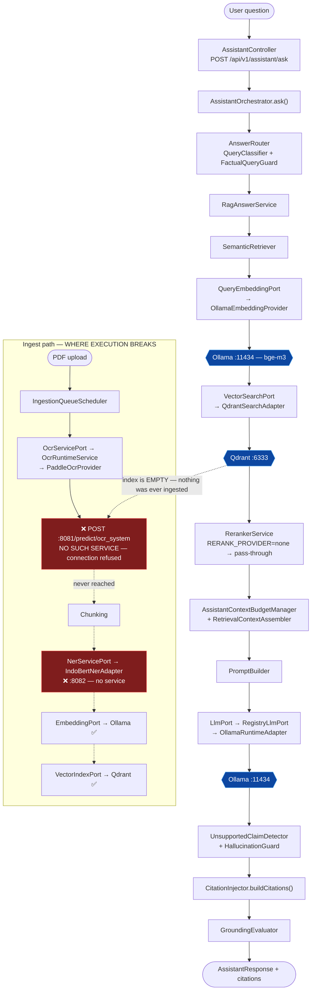

# Sprint 6 — RAG Pipeline Trace & Sidecar Inventory

> Source-traceable analysis. Produced under CLAUDE.md rule 10 (ANALYSIS_FIRST) and rule 5 (output → /generated).
> Written to `/generated/sprint6/` because `/generated/docs/` is owned by `extrasugar` and is not
> writable by `claude2` (mode `drwxr-xr-x`). See "Remaining manual steps".
>
> **No source files were modified in this sprint.** See §5 for why that is the correct outcome.

---

## 1. Sidecar dependency inventory

| Dependency | Port (interface) | Adapter (Java) | Service (deployable) | Status |
|---|---|---|---|---|
| Embedding | `ingest/…/EmbeddingPort`, `search/…/QueryEmbeddingPort` | `IngestEmbeddingRuntimeAdapter`, `QueryEmbeddingRuntimeAdapter`, `OllamaEmbeddingProvider`, `SidecarEmbeddingProvider` | **Ollama** (compose ✅) or sidecar `:8084` (❌) | **implemented** — default `EMBED_PROVIDER=ollama` targets a service that exists |
| Vector store | `ingest/…/VectorIndexPort`, `search/…/VectorSearchPort` | `QdrantIndexAdapter`, `QdrantSearchAdapter` | **Qdrant** `:6333` (compose ✅) | **implemented** |
| LLM | `assistant/…/LlmPort` | `RegistryLlmPort` → `OllamaRuntimeAdapter` | **Ollama** `:11434` (compose ✅) | **implemented** (Ollama only) |
| Reranker | `search/…/RerankerPort` | `RerankerAdapter`, `RegistryRerankerPort` | sidecar `:8083` (❌) | **partial** — default `RERANK_PROVIDER=none`; pipeline runs without it |
| OCR | `ingest/…/OcrServicePort` | `OcrRuntimeService` → `PaddleOcrProvider` | PaddleOCR sidecar `:8081` (❌) | **MISSING SERVICE** — adapter complete, nothing to call |
| NER | `ingest/…/NerServicePort` | `IndoBertNerAdapter` | IndoBERT sidecar `:8082` (❌) | **MISSING SERVICE** — adapter complete, nothing to call |
| Supabase / Postgres | Spring Data / JDBC | `…/persistence/postgres/*RepositoryImpl` | Postgres (compose ✅ / Supabase in prod) | **implemented** |
| OpenRouter | — | **none** | — | **dead config** — see §4 |
| Gemini | — | **none** | — | **dead config** — see §4 |

**Every port has an adapter.** Nothing is missing in Task 3's sense ("interfaces exist but adapters do
not"). What is missing are two *deployable model-serving services* that live outside this Java repo.

---

## 2. Trace of one user question

Read from: `AssistantController` → `AssistantOrchestrator` → `AnswerRouter` → `RagAnswerService`
→ `SemanticRetriever` → `QdrantSearchAdapter` → `PromptBuilder` → `RegistryLlmPort` → `CitationInjector`.

### Where it stops

The **query path is code-complete and its dependencies exist** — Ollama and Qdrant are both in
`infra/docker/docker-compose.yml`, and the defaults (`LLM_PROVIDER=ollama`, `EMBED_PROVIDER=ollama`,
`RERANK_PROVIDER=none`) route entirely around the missing sidecars. It does **not** break on a
missing adapter.

It breaks on **empty data**. Ingestion's first step is OCR, and the PaddleOCR service at `:8081`
does not exist anywhere in this repository. So Qdrant is never populated, retrieval returns zero
chunks, and a RAG answer with no context is either a refusal (STRICT mode, `FactualQueryGuard`) or
an ungrounded answer that `HallucinationGuard` suppresses.

**The pipeline is not broken. It is starved.**

---

## 3. Missing services — exact contracts

Derived from the adapters, so an implementer has a spec rather than a guess.

### OCR sidecar — `:8081` (`PaddleOcrProvider`)
- `GET /health` → 200 (read by `OcrHealthIndicator`)
- `POST /predict/ocr_system` — JSON in, JSON out (`Map<String,Object>`)
- `POST /predict/ocr_system/batch` — batch variant
- Budget: `OCR_TIMEOUT=120000` ms **per document, across all retry attempts**
- Config: `notarist.sidecar.ocr.base-url` / `OCR_BASE_URL`

### NER sidecar — `:8082` (`IndoBertNerAdapter`)
- `POST {ner.endpointUrl}/extract` — JSON in, `Map` out
- Config: `notarist.sidecar.ner.base-url` / `NER_BASE_URL`

### Reranker sidecar — `:8083` (`RerankerAdapter`) — OPTIONAL
- Not required. `RERANK_PROVIDER` defaults to `none`.

---

## 4. Dead code / dead config

| Item | Evidence | Assessment |
|---|---|---|
| `openrouter-api-key`, `gemini-api-key` (Terraform Secret Manager) | Every `gemini`/`openrouter` mention under `backend/**/*.java` is a **JavaDoc comment**. `InferenceProvider` has exactly one impl: `OllamaRuntimeAdapter`. | Terraform provisions credentials **no code can consume**. Dead *config*, not dead code. |
| `SidecarEmbeddingProvider` | Real impl; `EMBED_PROVIDER` defaults to `ollama`; no `:8084` service exists. | Keep — it is the seam for a dedicated bge-m3 host. |
| `RerankerAdapter` | Real impl; `RERANK_PROVIDER=none`. | Keep — seam, not dead. |
| **CLAUDE.md** | Declares **Oracle 19C**, schemas `BRANCHPERFSTAGINGDB` / `BRANCHPERFAPPDB`, "local LLM". Reality: Postgres/Supabase (`persistence/postgres/*`, `RlsContextApplier`, `PostgresConnectionConfig`); no such schemas exist. | **Stale project charter.** Highest-risk item in this table: it is the first thing every agent is instructed to read, and rule 4 ("Semua SQL Oracle 19C compatible") is now actively wrong. |

---

## 5. Why nothing was implemented

The sprint rules are explicit: *do not fabricate endpoints; do not create placeholder services; do
not mock production APIs; if a dependency is missing, report it.*

- **Task 3 (missing adapters)** — none are missing. Every port has a real HTTP adapter.
- The two genuinely missing pieces are **Python model-serving services** (PaddleOCR, IndoBERT), not
  Java adapters. Writing them here would be creating placeholder services — explicitly forbidden —
  and they do not belong in a Java repo in any case.
- **Task 9 (end-to-end test)** — not executable here: no Docker daemon, and nothing listening on
  `6333 / 11434 / 8081 / 8082 / 8083 / 8084`. Reporting a passing E2E run would be a fabrication.

**Verified instead:** `./gradlew compileJava --offline` → `BUILD SUCCESSFUL` (exit 0, 30 tasks,
all 15 modules compile).
